Zero-knowledge proofs are famous for packing incredible security into tiny proofs, but how do they actually pull that off?

The secret is in the **Inner Product Argument (IPA)**, the mathematical engine behind Bulletproofs.

In this post, we’ll peel it apart step by step and see how it really works, complete with runnable SageMath code you can play with yourself, because nothing beats code for building intuition.

This is part two of a small series on the IPA/Bulletproof protocol. If you missed part 1, start there for the big picture: [High-level intuitions for the Bulletproofs/IPA protocol](https://cryptologie.net/posts/high-level-intuitions-for-the-bulletproofsipa-protocol/).

Here, we’ll zoom in on the core of the protocol and uncover the mysterious `L` and `R` “cross terms” that make it all click.

If you’re curious, the scripts are up [on GitHub](https://github.com/teddav/bulletproof-ipa).

But let’s warm up first. We’ll start with the bare essentials: no commitments, no elliptic curves, no zero-knowledge magic. Just vectors and inner products. Once that picture is clear, adding the crypto magic (Pedersen commitments) will feel much more natural.

## The Inner Product Argument, Step One: No Commitments Yet

We start with two vectors $\vec{a}$ and $\vec{b}$. The prover wants to convince the verifier that their inner product is some value `c`

$$
\langle \vec{a},\vec{b} \rangle = c
$$

Of course, if we’re not hiding anything, the prover could just send both vectors to the verifier. Easy, but boring 🥱. The real challenge is:

- send less data
- make verification faster

That’s where folding comes in.

### Folding Vectors to Compress the Proof

We already saw folding in part 1:

- we split each vector into two halves
- then squash them into a new, shorter vector using a random linear combination

Each round halves the length, until we’re left with just a single entry.

For this to work smoothly, we need:

- $\vec{a}$ and $\vec{b}$ to have the same length
- that length to be a power of 2 (if not we can just pad with zeros)

Let’s say we have $\vec{a}=(a_1,a_2,a_3,a_4)$

We split it:

$$
a_L=\binom{a_1}{a_2},
a_R=\binom{a_3}{a_4}
$$

The verifier sends a random challenge `x` (or we get it via Fiat-Shamir). Then we fold like this:

$$
\vec{a'} = x \cdot a_L + x^{-1} \cdot a_R
$$

We call $\vec{a'}$ the folded version of a vector $\vec{a}$.

The way we compute it with $x$ and $x^{-1}$ will make terms cancel each other out, and is the key to how our proof works.

Let’s see what it looks like with Sage:

```python
def fold(vec, val):
    assert len(vec) % 2 == 0

    half = len(vec) // 2

    left = vector(vec[:half])
    right = vector(vec[half:])
    return left * val + right * (1 / val)
```

Here `val` is the challenge previously sent by the verifier.

### Understanding the L and R Cross Terms

When folding, we don’t just shrink the vectors. We also create some “spillover” terms, which the protocol calls `L` and `R`:

$$
\begin{aligned}
L = \langle a_L,b_R \rangle = \langle \binom{a_1}{a_2},\binom{b_3}{b_4} \rangle \\
R = \langle a_R,b_L \rangle = \langle \binom{a_3}{a_4},\binom{b_1}{b_2} \rangle
\end{aligned}
$$

These are crucial parts of the proof. The prover needs to send them to the verifier.

```python
def get_LR(a, b):
    assert len(a) == len(b)
    assert len(a) % 2 == 0

    half = len(a) // 2

    aL = vector(a[:half])
    aR = vector(a[half:])
    bL = vector(b[:half])
    bR = vector(b[half:])

    L = aL * bR
    R = aR * bL
    return L, R
```

### Putting It All Together: The Reduction Step

Let’s check what happens when we fold and then take the inner product:

$$
\begin{aligned}
\langle \vec{a'},\vec{b'} \rangle
&= \langle \binom{a_1x+a_3x^{-1}}{a_2x+a_4x^{-1}},\binom{b_1x^{-1}+b_3x}{b_2x^{-1}+b_4x} \rangle \\
&= (a_1x+a_3x^{-1})(b_1x^{-1}+b_3x)+(a_2x+a_4x^{-1})(b_2x^{-1}+b_4x) \\
&= (a_1b_1+a_1b_3x^2+a_3b_1x^{-2}+a_3b_3)+(a_2b_2+a_2b_4x^2+a_4b_2x^{-2}+a_4b_4) \\
&= a_1b_1+a_2b_2+a_3b_3+a_4b_4
+(a_1b_3+a_2b_4)x^2
+(a_3b_1+a_4b_2)x^{-2} \\
&= \langle \vec{a},\vec{b} \rangle + Lx^2 + Rx^{-2}
\end{aligned}
$$

And voilà: the cross terms appear naturally.

So in each round, the prover sends `(L, R)` to the verifier, then both parties move on to the next round.

**Crucial detail:**

The challenge `x` must be sampled **after** the prover commits to `L` and `R`. Otherwise, the prover could find a way to cheat 😱.

That’s why the order matters:

1. Prover computes `L` and `R`
2. Verifier sends challenge `x` (or it’s derived via Fiat–Shamir)
3. Folding happens

If we flipped the order, the prover could forge `L` and `R` to make everything check out, even if the inner product of `a` and `b` isn’t actually `c`.

### One Full Round of the Protocol

Enough with the formulas, let’s see how one complete round works in Sage:

```python
p = 929
Fp = GF(p)

def fold(vec, val):
		...

def get_LR(a, b):
    ...

# This needs to be even length
a = vector([Fp.random_element() for _ in range(8)])
b = vector([Fp.random_element() for _ in range(8)])

c = a * b
print("We want to prove that c = a * b")
print("c = ", c)

print("\nRound 1:")
print("inner product round 1 = ", c)
L1, R1 = get_LR(a, b)

x1 = Fp.random_element()
print(f"\nRandom challenge x1: {x1}\n")

a_prime1 = fold(a, x1)
b_prime1 = fold(b, 1 / x1)
print("a_prime1 = ", a_prime1)
print("b_prime1 = ", b_prime1)

c_prime1 = c + (L1 * x1 ^ 2) + (R1 * x1 ^ (-2))
assert c_prime1 == a_prime1 * b_prime1
print("Round 1 successful")
print("Prover sends L1 and R1 to the Verifier\n")
```

### Fold, Repeat, Prove

We keep folding until $\vec{a}$ and $\vec{b}$ shrink to length 1.

For example, suppose we started with 8 entries. That means 3 folding rounds. By the end, the verifier has received:

$$
(L_1,R_1),(L_2,R_2),(L_3,R_3),\vec{a'''},\vec{b'''}
$$

and challenges: $x_1,x_2,x_3$.

The verifier checks:

$$
c \stackrel{?}{=} \langle \vec{a'''},\vec{b'''} \rangle - (x_1^2 \cdot L_1 + x_1^{-2} \cdot R_1) - (x_2^2 \cdot L_2 + x_2^{-2} \cdot R_2) - (x_3^2 \cdot L_3 + x_3^{-2} \cdot R_3)
$$

This works because each round’s inner product “unfolds” into the previous one, all the way back to the original $\langle \vec{a},\vec{b} \rangle = c$.

$$
\begin{aligned}
\langle \vec{a'''},\vec{b'''} \rangle &= \langle \vec{a''},\vec{b''} \rangle + (x_3^2 \cdot L_3 + x_3^{-2} \cdot R_3) \\
\langle \vec{a''},\vec{b''} \rangle &= \langle \vec{a'},\vec{b'} \rangle + (x_2^2 \cdot L_2 + x_2^{-2} \cdot R_2) \\
\langle \vec{a'},\vec{b'} \rangle &= \langle \vec{a},\vec{b} \rangle + (x_1^2 \cdot L_1 + x_1^{-2} \cdot R_1) \\
\langle \vec{a},\vec{b} \rangle &= c
\end{aligned}
$$

### Let’s Code It

We now walk through the protocol step by step, using small vectors so you can clearly see the folding and cross terms happening.

```python
p = 929
Fp = GF(p)

def fold(vec, val):
		...

def get_LR(a, b):
    ...

# This needs to be even length
a = vector([Fp.random_element() for _ in range(8)])
b = vector([Fp.random_element() for _ in range(8)])

c = a * b
print("We want to prove that c = a * b")
print("c = ", c)

print("\nRound 1:")
...

print("\nRound 2:")
c2 = a_prime1 * b_prime1
print("inner product round 2 = ", c2)
L2, R2 = get_LR(a_prime1, b_prime1)

x2 = Fp.random_element()
print(f"\nRandom challenge x2: {x2}\n")

a_prime2 = fold(a_prime1, x2)
b_prime2 = fold(b_prime1, 1 / x2)
print("a_prime2 = ", a_prime2)
print("b_prime2 = ", b_prime2)

c_prime2 = c2 + x2 ^ 2 * L2 + x2 ^ (-2) * R2
assert c_prime2 == a_prime2 * b_prime2
print("Round 2 successful")
print("Verifier receives L2, R2\n")

print("\nRound 3:")
c3 = a_prime2 * b_prime2
print("inner product round 3 = ", c3)
L3, R3 = get_LR(a_prime2, b_prime2)

x3 = Fp.random_element()
print(f"\nRandom challenge x3: {x3}\n")

a_prime3 = fold(a_prime2, x3)
b_prime3 = fold(b_prime2, 1 / x3)
print("a_prime3 = ", a_prime3)
print("b_prime3 = ", b_prime3)

c_prime3 = c3 + x3 ^ 2 * L3 + x3 ^ (-2) * R3
assert c_prime3 == a_prime3 * b_prime3
print("Round 3 successful", c_prime3)
print("Verifier receives L3, R3\n")

print("a and b now have length 1")
print("We can send a_prime3 and b_prime3 to the verifier")

print("\nVerifier now has: a_prime3, b_prime3, L3, R3, L2, R2, L1, R1\n")
```

The verifier can now just check the final equality:

```python
assert c == a_prime3 * b_prime3 \
    - (x1 ^ 2 * L1 + x1 ^ (-2) * R1) \
    - (x2 ^ 2 * L2 + x2 ^ (-2) * R2) \
    - (x3 ^ 2 * L3 + x3 ^ (-2) * R3)

print("Verification successful!")
```

You can find the entire script here: https://github.com/teddav/bulletproof-ipa/blob/main/ipa-simple.sage

Running this makes the folding process tangible: you see how each round adds cross terms, how challenges enter, and how the verifier ties it all back to the original claim.

That’s the core idea of the inner product argument without commitments or zero-knowledge.

**Cheating?**

But… if we stop here, the prover could still cheat.

They can’t fake a folding step once the challenge is fixed, but they could start with completely fake vectors $\vec{a'},\vec{b'}$ that happen to give the right inner product `c`.

$$
\langle \vec{a'},\vec{b'} \rangle = \langle \vec{a},\vec{b} \rangle = c
$$

and the verifier would have no way of knowing which pair is the correct one, since nothing ties the proof back to the original vectors.

I wrote a quick example of that: https://github.com/teddav/bulletproof-ipa/blob/main/ipa-cheat.sage

## Lock It In: Commitments!

To prevent cheating, we need the prover to bind themselves to $\vec{a}$ and $\vec{b}$ before the protocol starts. Enter Pedersen commitments.

We set up two vectors of elliptic curve points:

$$
\begin{aligned}
\vec{G}=(G_1,...,G_n) \\
\vec{H}=(H_1,...,H_n)
\end{aligned}
$$

```python
p = 929
Fp = GF(p)
E = EllipticCurve(Fp, [5, 15])
G = E.gens()[0]
Fr = GF(G.order())
assert is_prime(G.order())

Gs = [E.random_point() for _ in range(N)]
Hs = [E.random_point() for _ in range(N)]
```

In our script we use random points for simplicity, but obviously $\vec{G},\vec{H}$ are fixed public generators, known to everyone.

Then we define commitments as:

$$
\begin{aligned}
C_a=\langle\vec{a},\vec{G} \rangle \\
C_b=\langle\vec{b},\vec{H} \rangle
\end{aligned}
$$

Next, we also commit to the claimed inner product using another random curve point `Q` (chosen so nobody knows its discrete log relation to the other bases):

$$
C_{ab} = \langle \vec{a},\vec{b} \rangle \cdot Q
$$

Finally, we glue everything together into a single “master” commitment `P`:

$$
P = C_a + C_b + C_{ab}
$$

This `P` is the object we’ll fold on, just like we did with the plain vectors earlier.

The magic is that the structure of P ensures the verifier can still check everything with only logarithmic communication, but now **the prover can’t swap in fake vectors, because their commitments tie them down from the very start to $\vec{a},\vec{b}$**

### The Full Protocol in Action

You guessed it: the protocol is exactly the same as before, except the prover needs to do a bit more work, since we now handle three different inner products and their commitments.

I won’t dwell on every single detail, but let’s see briefly how one round goes.

**Cross terms**

Cross terms now involve the vectors $\vec{G}$ and $\vec{H}$.

As before, we call $x_L$ the left half of vector $\vec{x}$ and $x_R$ for the right half.

$$
\begin{aligned}
L = \langle a_L, G_R \rangle + \langle b_R, H_L \rangle + \langle a_L, b_R \rangle \cdot Q \\
R = \langle a_R, G_L \rangle + \langle b_L, H_R \rangle + \langle a_R, b_L \rangle \cdot Q
\end{aligned}
$$

```python
def get_LR(a, b, Gs, Hs):
    assert len(a) == len(b)
    assert len(a) % 2 == 0
    half = len(a) // 2

    aL = a[:half]
    aR = a[half:]

    bL = b[:half]
    bR = b[half:]

    GL = Gs[:half]
    GR = Gs[half:]

    HL = Hs[:half]
    HR = Hs[half:]

    L = inner_product(aL, GR) + inner_product(bR, HL) + \
        inner_product(aL, bR) * Q

    R = inner_product(aR, GL) + inner_product(bL, HR) + \
        inner_product(aR, bL) * Q

    return L, R
```

**Folding**

Previously we folded only $\vec{a}$ and $\vec{b}$. Now we need to fold: $\vec{a},\vec{b},\vec{G},\vec{H}$.

This gives:

$$
\begin{aligned}
\vec{a'}&=\text{fold}(\vec{a}) \\
\vec{b'}&=\text{fold}(\vec{b}) \\
\vec{G'}&=\text{fold}(\vec{G}) \\
\vec{H'}&=\text{fold}(\vec{H}) \\
P' &= \langle \vec{a'},\vec{G'} \rangle + \langle \vec{b'},\vec{H'} \rangle + \langle \vec{a'},\vec{b'} \rangle \cdot Q
\end{aligned}
$$

```python
def fold(vec, val):
    assert len(vec) % 2 == 0
    half = len(vec) // 2

    left = vec[:half]
    right = vec[half:]
    return [left[i] * val + right[i] * (1 / val) for i in range(half)]
```

We can now check that:

$$
P'= P + x^2 \cdot L + x^{-2} \cdot R
$$

That was easy!

We now have a protocol that verifies an inner product while binding the prover to the vectors. But we can make the verifier’s job much cheaper.

### Run It Yourself with SageMath

Let’s see one round with commitments:

```python
...

print("We define Q as a random point on the curve")
Q = E.random_point()

def inner_product(a, b):
		...

def fold(vec, val):
		...

def get_LR(a, b, Gs, Hs):
		...

# Length of the vectors (this needs to be even length)
N = 8

a = [Fr.random_element() for _ in range(N)]
b = [Fr.random_element() for _ in range(N)]

c = inner_product(a, b)
print("We want to prove that c = a * b")
print("c = ", c)

P = inner_product(a, Gs) + inner_product(b, Hs) + c * Q
print("P = ", P)

print("\nRound 1:")

L1, R1 = get_LR(a, b, Gs, Hs)

x1 = Fr.random_element()
print(f"\nRandom challenge x1: {x1}\n")

a_prime1 = fold(a, x1)
b_prime1 = fold(b, 1 / x1)
G_prime1 = fold(Gs, 1 / x1)
H_prime1 = fold(Hs, x1)

P_prime1 = inner_product(a_prime1, G_prime1) + inner_product(b_prime1,
                                                             H_prime1) + inner_product(a_prime1, b_prime1) * Q

assert P_prime1 == P + x1 ^ 2 * L1 + x1 ^ (-2) * R1
print("Round 1 successful")
print("Verifier receives L1, R1\n")

print("\nRound 2:")

...

print("Round 2 successful")
print("Verifier receives L2, R2\n")

print("\nRound 3:")

...

print("Round 3 successful")
print("Verifier receives a_prime3, b_prime3, L3, R3\n")
```

Find the full script here: https://github.com/teddav/bulletproof-ipa/blob/main/ipa-with-commitment.sage

### Verifier’s Final Check

For verification, the Verifier recomputes himself the folded bases by repeating all the `fold` operations on $\vec{G}$ and $\vec{H}$, using the challenges $x_i$

```python
print("\nVerification:")
print("Verifier now has: a_prime3, b_prime3, (L1, R1), (L2, R2), (L3, R3)\n")

print("He recomputes P_prime3:")
print("First needs to recompute G_prime3 and H_prime3, from the initial Gs and Hs")
verifier_G_prime1 = fold(Gs, 1 / x1)
verifier_G_prime2 = fold(verifier_G_prime1, 1 / x2)
verifier_G_prime3 = fold(verifier_G_prime2, 1 / x3)
assert verifier_G_prime3 == G_prime3
verifier_H_prime1 = fold(Hs, x1)
verifier_H_prime2 = fold(verifier_H_prime1, x2)
verifier_H_prime3 = fold(verifier_H_prime2, x3)
assert verifier_H_prime3 == H_prime3
print("verifier_G_prime3 = ", verifier_G_prime3)
print("verifier_H_prime3 = ", verifier_H_prime3)
```

Then he recomputes the final `P`

```python
verifier_P_prime3 = inner_product(a_prime3, verifier_G_prime3) + inner_product(
    b_prime3, verifier_H_prime3) + inner_product(a_prime3, b_prime3) * Q
print("verifier_P_prime3 = ", verifier_P_prime3)
```

and performs the final check:

```python
final_check = verifier_P_prime3 \
    - (x1 ^ 2 * L1 + x1 ^ (-2) * R1) \
    - (x2 ^ 2 * L2 + x2 ^ (-2) * R2) \
    - (x3 ^ 2 * L3 + x3 ^ (-2) * R3)
assert final_check == P

print("Verification successful!")
```

### Optimizing Verification

As stated before, the verifier needs to recompute the folded bases by repeating all the `fold` operations, that’s a lot of expensive elliptic curve operations...

But there’s a trick! Each final folded base (each coordinate of $\vec{G'}$ and $\vec{H'}$) is a **linear combination** of the original bases with coefficients that depend only on the challenges $x_1,x_2,...,x_k$.

In other words: after `k` rounds each original base $G_i$ contributes to exactly one coordinate of the final vector $\vec{G'}$. We scale $G_i$ by a coefficient $s_i$ that’s a product of powers of the challenges (either $x_r$ or $x_r^{-1}$).

The same holds for the $\vec{H}$ bases.

So instead of repeatedly folding points, the verifier can do this in one shot:

1. compute the weight $s_i$ for each original $G_i$ (and $s_i^{-1}$ for $H_i$)
2. compute the final folded bases using a single multiscalar multiplication:

$$
\begin{aligned}
G' &= \langle \vec{s},\vec{G} \rangle = \displaystyle\sum_{i=0}^{N-1} s_i * G_i \\
H' &= \langle \vec{s^{-1}},\vec{H} \rangle = \displaystyle\sum_{i=0}^{N-1} s_i^{-1} * H_i
\end{aligned}
$$

### Computing the Verification Weights

- For each element in the original vector, take its index `i`
- Write its binary representation over `k` bits, where `k` is number of folding rounds ($k = \log_2(N)$)
- Loop over each bit:
  - if the bit for that round is `0` (meaning $G_i$ is in the left half at that round), we multiply by $x_r^{-1}$
  - if the bit is 1, we use $x_r$

For $H$, it’s the opposite.

$$
s_i = \displaystyle\prod_{j=0}^{k-1} \begin{cases}
   x_j &\text{if bit}_j(i) = 1 \\
   x_j^{-1} &\text{if bit}_j(i) = 0
\end{cases}
$$

This matches what happens during folding:

- For $\vec{G}$, the left part is multiplied by $\frac{1}{x_r}$, right one with $x_r$
- For $\vec{H}$ it’s the reverse

If it’s easier, you can think of it like a tree:

```mermaid
graph TD

A0["Round 1<br/>x₁"]
A1["Left → 1/x₁"]
A2["Right → x₁"]

A0 --> A1
A0 --> A2

B1["Round 2<br/>x₂"]
B2["Round 2<br/>x₂"]
A1 --> B1
A2 --> B2

B1L["Left → 1/x₂"]
B1R["Right → x₂"]
B2L["Left → 1/x₂"]
B2R["Right → x₂"]

B1 --> B1L
B1 --> B1R
B2 --> B2L
B2 --> B2R

C1["Round 3<br/>x₃"]
C2["Round 3<br/>x₃"]
C3["Round 3<br/>x₃"]
C4["Round 3<br/>x₃"]

B1L --> C1
B1R --> C2
B2L --> C3
B2R --> C4

C1L["Left → 1/x₃<br/>→ G₀: (1/x₁)(1/x₂)(1/x₃)"]
C1R["Right → x₃<br/>→ G₁: (1/x₁)(1/x₂)(x₃)"]
C2L["Left → 1/x₃<br/>→ G₂: (1/x₁)(x₂)(1/x₃)"]
C2R["Right → x₃<br/>→ G₃: (1/x₁)(x₂)(x₃)"]
C3L["Left → 1/x₃<br/>→ G₄: (x₁)(1/x₂)(1/x₃)"]
C3R["Right → x₃<br/>→ G₅: (x₁)(1/x₂)(x₃)"]
C4L["Left → 1/x₃<br/>→ G₆: (x₁)(x₂)(1/x₃)"]
C4R["Right → x₃<br/>→ G₇: (x₁)(x₂)(x₃)"]

C1 --> C1L
C1 --> C1R
C2 --> C2L
C2 --> C2R
C3 --> C3L
C3 --> C3R
C4 --> C4L
C4 --> C4R

```



Here’s a small Sage helper that computes all final weights, and then the final folded bases in one go:

```python
xs = [x1, x2, x3]

s_G = [Fr(1) for _ in range(N)]
s_H = [Fr(1) for _ in range(N)]

for i in range(N):
    i_bits = bin(i)[2:].zfill(int(math.log(N, 2)))
    for k in range(int(math.log(N, 2))):
        bit_j = int(i_bits[k])
        if bit_j == 1:
            s_G[i] *= xs[k]
            s_H[i] *= 1 / xs[k]
        else:
            s_G[i] *= 1 / xs[k]
            s_H[i] *= xs[k]

print("s_G = ", s_G)
print("s_H = ", s_H)

G_final = inner_product(s_G, Gs)
H_final = inner_product(s_H, Hs)
assert G_final == G_prime3[0]
assert H_final == H_prime3[0]
```

This way, the verifier skips $\log N$ rounds of folding and replaces them with a single multiscalar multiplication, which most libraries can evaluate very efficiently. A massive win in verification cost.
