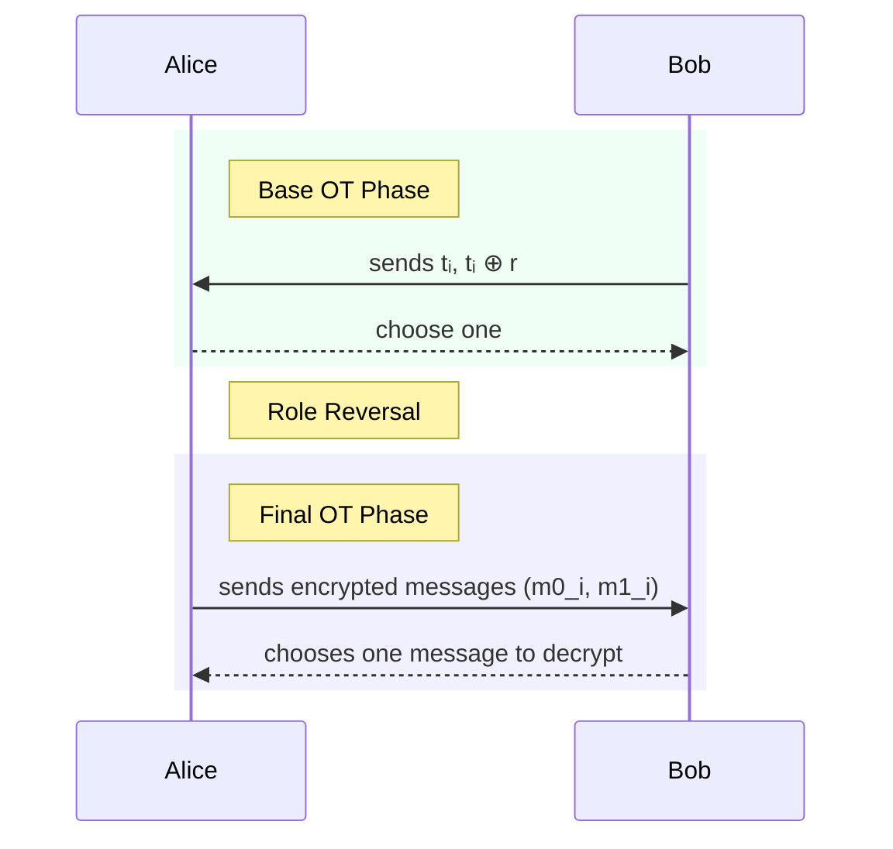

## Oblivious transfer

Oblivious transfer (OT) is a basic two-party cryptographic protocol between a sender, who holds a collection of messages, and a receiver, who wants to obtain some of them. In an OT, the receiver picks exactly which messages to learn but learns nothing about the others and the sender learns nothing about the receiver’s choice. Common flavors are:

- 1-out-of-2 OT, where the sender has two messages and the receiver picks one;
- 1-out-of-m OT, where the sender has $m$ $$messages and the receiver picks one;
- n-out-of-m OT, where the receiver picks any $n$ of the sender’s $m$ messages.

The choice of `n` and `m` depends entirely on the application’s needs.

For example, imagine the sender has answers to 10 multiple-choice questions, and the receiver only wants the answer to question 3. OT lets them get that one answer, without the sender knowing which question they asked about, and without learning anything about the other 9 answers.

### OT variants

The simplest type of OT is 1-out-of-2, where the sender has two messages, and the receiver picks one of them. There are several useful variations of this basic form:

- Standard OT (Chosen-message OT): The sender chooses both messages, $m_0$ and $m_1$, and the receiver selects one ($m_b$ for some bit $b \in \{0,1\}$) without revealing their choice.
  
- Random OT (ROT): The two messages $m_0$ and $m_1$ are _not_ chosen by the sender. Instead, the protocol itself generates them at random, and both the sender and receiver learn only their respective parts. This is often used as a building block for more advanced protocols.
  
- Correlated OT (COT): The sender does not choose two completely independent messages. Instead, they choose one message $m_0$, and the second is computed as $m_1 = m_0 \oplus \Delta$, where $\Delta$ is a fixed correlation value. The receiver still learns only one of the two.
  
- Random Correlated OT (RCOT): Like COT, the two messages are correlated using a value $\Delta$, but here $r_0$ is generated randomly by the protocol itself rather than chosen by the sender. So the pair looks like $(r, r \oplus \Delta)$, where $r$ is a random value.
  

These variants are especially useful in practice, particularly in efficient implementations of OT extension (discussed later), where generating many lightweight OTs with specific properties is needed.

## Security Models for OT

The security of an Oblivious Transfer protocol is defined by the type of adversary it can defend against. Different protocols offer different levels of assurance, which fall into two main categories:

- **Semi-Honest (or Passive) Security:** It assumes both parties follow the protocol's instructions exactly but may try to learn extra information by analyzing the messages they receive. A protocol secure in this model guarantees that an honest-but-curious party learns nothing beyond what they are entitled to.
- **Malicious (or Active) Security:** This is a much stronger model that assumes an adversary can deviate from the protocol in any way they choose. They can send malformed messages, use inconsistent inputs, or abort prematurely to try and break the security. A maliciously secure protocol guarantees that an honest party is always protected: either the protocol completes correctly with all secrets intact, or the honest party detects the cheating and aborts, preventing any security breach.

These distinctions are crucial, as foundational protocols like basic OT extensions are often designed for the semi-honest model, while more advanced versions add specific checks to provide robust security against malicious adversaries.

## Base OT

Base OTs are a small number of 1-out-of-2 Oblivious Transfers that are run at the setup phase of larger protocols, such as OT extension. They are called “base” because they provide the secure foundation from which many more lightweight OTs can be generated. Base OTs are considered computationally expensive as they typically rely on public-key cryptography such as elliptic curve operations or modular exponentiation which are slower than symmetric cryptographic operations. However, only a small number of base OTs are needed, so this cost is acceptable in practice. Once the base OTs are completed, the parties can use them to securely derive thousands or millions of fast OTs using only efficient symmetric cryptography (ex: AES).

A widely used protocol for base OT is the [Chou-Orlandi protocol (2015)](https://eprint.iacr.org/2015/267.pdf), which is optimized for speed and low communication overhead.

### Chou-Orlandi

The Chou-Orlandi protocol is an efficient implementation of 1-out-of-2 chosen-message Oblivious Transfer (OT) based on elliptic curve cryptography. It is designed to be fast and easy to batch, which makes it widely used in practice. A batched version of this protocol is implemented in the [MPZ library](https://github.com/privacy-ethereum/mpz/tree/8a57d9891e1941405c31f1b53266e96181b31b26/crates/ot-core/src).

In this protocol, the Sender holds two messages and wants to send exactly one of them to the Receiver, depending on the Receiver’s choice bit, without learning which message was chosen. To achieve this, the protocol derives two shared secret keys through an Elliptic Curve Diffie-Hellman (ECDH) style exchange: one key corresponds to each message.

The Sender uses these keys to encrypt (mask) their two messages, while the Receiver can only derive the key matching their choice bit and thus decrypt only their selected message. This ensures the Receiver learns nothing about the unchosen message, and the Sender learns nothing about the Receiver’s choice.

Although it’s a chosen-message OT, it can be easily adapted into Random OT (ROT) by treating these derived encryption keys as the random messages themselves.

At a high level, the protocol is built on the principles of ECDH key exchange:

Let:

- $g$ be the base point of an elliptic curve
- $a$, $b$ be random private scalars chosen by the Sender and Receiver, respectively
- $c \in \{0,1\}$ be the receiver’s choice bit

1.  Sender’s setup:
    The sender picks a random private key and computes their public key:
    $$
         A = a ⋅ g
    $$
2.  The Receiver sends to the receiver his public key $B$, based on his choice bit $c$:
    - if $c = 0$
      $$
       B = b ⋅ g
      $$
    - if $c = 1$
      $$
      B = A + b⋅g
      $$
3.  The Sender computes both keys:

    Using their private key $a$ and the received public key $B$, the sender computes:

    $$
    \begin{aligned}
    &k_0 = hash(a ⋅ B) \\
    &k_1 = hash( a ⋅ (B - A))
    \end{aligned}
    $$

    These are used as symmetric keys to encrypt messages

4.  The Receiver computes a single key using his secret $b$:

    $$
    k_r = hash(b ⋅ A) = hash(a⋅b⋅g)
    $$

    This match exactly one of $k_0$ or $k_1$ depending on $c$.
    The receiver can decrypt one message, but gains no information about the other.

Let’s see what values the sender computes, and why only one matches the receiver’s key.

- if $c = 0$:
  - $B = b ⋅ g$
  - Receiver computes
    $$
    k_r = hash(b ⋅ A) = hash(a⋅b⋅g)
    $$
  - Sender computes
    $$
    \begin{aligned}
         &k0 = hash(a ⋅ (b ⋅ g)) = hash(a ⋅ b ⋅ g) \leftarrow \text{matches } k_r\\
        &k1 = hash(a ⋅ (b ⋅ g - a ⋅ g)) = hash(a ⋅ (b - a) ⋅ g)
    \end{aligned}
    $$
- if $c = 1$:
  - $B = A + b ⋅ g = a ⋅ g + b ⋅ g$
  - Receiver computes:
    $$
    k_r = hash(b ⋅ A) = hash(a⋅b⋅g)
    $$
  - Sender computes:
    $$
         \begin{aligned}
    k0 &= hash(a ⋅ (A + b ⋅ g)) = hash(a ⋅ (a + b) ⋅ g) \\
    k1 &= hash(a ⋅ (B - A))= hash(a ⋅ b ⋅ g) \leftarrow \text{matches } k_r
    \end{aligned}
    $$

In both cases, only one key matches, depending on the receiver's choice $c$ and the sender cannot tell which one.

A full implementation can be found in [MPC by hand](https://github.com/teddav/mpc-by-hand)

## OT extensions

As discussed earlier, base OTs are expensive because they rely on public-key cryptography, which makes generating millions of them impractical.

OT extensions solve this by allowing two parties to efficiently generate a large number of OTs using only a small number of base OTs, followed by fast symmetric-key operations. These protocols work in two main steps:

- Initialization: Perform a small, fixed number of base OTs using public-key cryptography (like Chou Orlandi). The outputs act as shared seeds.
- Extension: Use those seeds to generate many more OTs, thousands or even millions, using only symmetric primitives.

The most widely used OT extension protocol is IKNP, which is secure in the semi-honest model.

For stronger security against actively malicious parties, the KOS protocol extends IKNP with additional checks to detect cheating.

### IKPN

The IKNP protocol is an efficient OT extension that lets two parties generate a large number of 1-out-of-2 OTs using only a small number of expensive base OTs. It operates in the semi-honest model, where both parties follow the protocol but may try to learn additional information.

The key idea is to use symmetric encryption (ex: hash functions) to mask each message so that:

- The receiver can only decrypt one message based on their choice bit.
- The sender learns nothing about that choice.

A clever trick in IKNP is a role reversal during the base OTs:

- The party who is the sender in the final OTs (we’ll call her Alice) acts as the receiver in the base OTs.
- The party who is the receiver in the final OTs (we’ll call him Bob) acts as the sender in the base OTs.

This swap allows them to establish correlated data that both can later use to derive the right symmetric keys for the actual OTs.
Here is a high level overview:

1. The setup

   Alice inputs: $m$ pairs of messages of length $l$ bits

   Bob inputs: a choice bit vector $r∈\{0,1\}^m$

2. Bob (Receiver in final OT) builds inputs for base OT
   - Bob generate a matrix $T∈\{0,1\}^{m \times k}$
     and construct inputs of the base OT like:
     $$
     (t^i, t^i ⊕ r) \text{ for any column i} \\
     $$
   - Bob acts as the sender in `k` base OTs, using each pair as the two possible messages.
3. Alice (sender in final OT) participates in base OT

   - Alice generate a random bit vector $s∈\{0,1\}^k$
   - She acts as the receiver in the base OTs with choosing bit $s_i$ in each.
   - After the base OT, Alice will have received $k$ vectors of length $m$ and can construct the matrix $Q∈\{0,1\}^{m \times k}$ of size $m * k$ that satisfy for each columns:
     $$
     q^i = \begin{cases}
        t^i &\text{if } s_i = 0 \\
        t^i ⊕ r  &\text{if } s_i = 1
     \end{cases}
     $$

   We can rework this equation into:

   $$
   \begin{aligned}
   q^i &= (s_i ⋅ r) ⊕ t^i \text{ for any column i} \\
   q_j &= (s ⋅ r_j) ⊕ t_j  \text{ for any row j}
   \end{aligned}
   $$

   Where $s$ is Alice’s bit vector and $r_j∈\{0,1\}$ is Bob’s choice bit for row $j$. The base OT is now finished.

4. Now Alice wants to send $m_{0,j}$ and $m_{1,j}$ to Bob in a way that:

   - Bob can decrypt only one of them (based on $r_j$)
   - Alice doesn’t know which one

   For each OT index $j$:

   - Alice computes two keys:
     $$
     \begin{aligned}
     &k_0 = hash(j, q_j) \\
     &k_1 = hash(j, q_j ⊕ s)
     \end{aligned}
     $$
     She uses there to encrypt:
     $$
     \begin{aligned}c_0 &= m_{0,j} \oplus k_0 \\c_1 &= m_{1,j} \oplus k_1\end{aligned}
     $$
   - Bob computes:
     $$
     k_r = hash(j, t_j)
     $$
     He then decrypts:
     $$
     m_{r_j,j} = c_{r_j} \oplus k_r
     $$

This works because the key values align depending on Bob's bit $r_j$:

- if $r = 0$:
  - Alice has:
    $$
    \begin{aligned}
    q_j &= (s ⋅ 0) ⊕ t_j = t_j\\
    k_0 &= hash(j, t_j) \\
        k_1
    &= hash(j, t_j ⊕ s)
    \end{aligned}
    $$
  - Bob computes:
    $$
    k_r = hash(j, t_j) = k_0
    $$
- if $r = 1$
  - Alice has:
    $$
    \begin{aligned}
    q_j &= s ⊕ t_j\\
    k_0 &= hash(j, t_j ⊕ s) \\
    k_1 &= hash(j, t_j)
    \end{aligned}
    $$
  - Bob computes:
    $$
    k_r = hash(j, t_j) = k_1
    $$

So Bob always gets exactly one key matching his choice, and Alice can’t tell which one he used.

A full implementation can be found in [MPC by hand](https://github.com/teddav/mpc-by-hand).

### KOS

KOS15 is a security-hardened improvement of the IKNP protocol, designed to defend against malicious receivers in OT extension. It provides the same functionality generating many 1-out-of-2 OTs from a small number of base OTs but strengthens guarantees when parties might not follow the protocol honestly. The IKNP protocol works well in the semi-honest model, where both parties are assumed to follow the protocol honestly, even if they try to learn more from the messages they receive. But in the malicious model, where a party might arbitrarily deviate from the protocol to gain information, IKNP is vulnerable.

Specifically, a malicious receiver (Bob) can exploit the base OT phase, where the roles are reversed (i.e., Bob acts as the sender). Here's how the attack works:

Bob wants to learn Alice’s secret correlation vector \*\*\*\*$s \in \mathbb{F}_2^k$, which she uses to compute the OT masking keys. If Bob learns $s$ he can decrypt both messages in future OTs, completely breaking OT security.

In the base OT phase of IKNP, for each column $i$ of the matrix $T$, Bob is supposed to send a pair of messages: $(t^i, t^i \oplus r)$ where:

- $t^i \in \mathbb{F}_2^m$ is a random vector
- $r \in \{0,1\}^m$ is Bob’s choice vector, used _consistently across all columns_

However, if Bob is malicious, he can cheat by using a different \*\*\*\*$r$ per column:

Suppose Bob wants to learn $s_1$ (the first bit of Alice's secret vector $s$). He can:

1.  In column 1, use the vector:
    $r^{(1)} = (1, 0, 0, \dots, 0)$
    That is, only the first row has a 1, the rest are 0.
2.  This means the pair he sends becomes:
    $(t^1, t^1 \oplus r^{(1)})$
3.  When Alice selects either $t^1$ or $t^1 \oplus r^{(1)}$ depending on her bit $s_1$, she gets:

    $$
    q^1 = \begin{cases}t^1 & \text{if } s_1 = 0 \\t^1 \oplus r^{(1)} & \text{if } s_1 = 1\end{cases}
    $$

So:

- $q^1_1 = t^1_1 \text{ if } s_1 = 0$
- $q^1_1 = t^1_1 \oplus 1 \text{ if } s_1 = 1$

Bob knows $t^1$, so by comparing what Alice eventually encrypts using $q^1_1$, he can deduce $s_1$.

Later, in the extension phase, Alice sends two encrypted messages:

$$
c_0 = H(1, q_1) \oplus m_0 \\
c_1 = H(1, q_1 \oplus s) \oplus m_1
$$

If Bob knows (or guesses) either $m_0$ or $m_1$, he can invert the hash and recover $s$. Repeating this attack over all columns lets Bob reconstruct the full secret **$s$**. Once Bob knows $s$, he can derive both keys $k_0$ and $k_1$ in the final OT round:

- Decrypt both messages
- Break sender’s privacy
- Undermine the security of all protocols relying on OT

This is a critical failure, and exactly what KOS15 was designed to prevent.

To prevent this, KOS15 adds a correlation check step after the IKNP base phase. This check ensures that the receiver used a single, consistent choice vector $x$, without allowing them to tamper column-wise.

We will focus on the MPZ implementation of KOS15 which omits the final randomization phase (needed only for ROT) and uses the optimized IKNP base from [ePrint 2016/602](https://eprint.iacr.org/2016/602.pdf). We suppose you have knowledge of the IKNP protocol.

- The setup (modified IKNP): Alice and Bob execute the IKNP protocol up to but not including the final message hashing and output step. At the end both hold matrices:
  - Bob: $T = [t_1, \dots, t_{\ell'}]$
  - Alice: $Q = [q_1, \dots, q_{\ell'}]$
  - Their rows satisfy:
    $$
    t_j = q_j + x_j ⋅ \Delta
    $$
  - $x_j \in \{0,1\}$ is Bob’s choice bit
  - $\Delta \in \mathbb{F}_2^k$ is Alice’s hidden correlation string
- The correlation check: to confirm that Bob used a single consistent x, a random linear check is performed.
  - Bob (Receiver) computes:
    $$
    x = \sum_{j = 1}^{l'} x_j \cdot \chi_j \text{ and } t = \sum_{j = 1}^{l'} t_j \cdot \chi_j
    $$
    where $\chi_j \in \mathbb{F}_2$ are random challenge bits (agreed by both parties).
    Bob sends $(x,t)$ to Alice
  - Alice (Sender) computes:
    $$
    q = \sum_{j = 1}^{l'} q_j \cdot \chi_j \\
    \text{and then checks} \\
    t \stackrel{?}{=} q + x \cdot \Delta
    $$
    If the equation holds: continue with OT
    If the check fails, it aborts: it means Bob tried to cheat.
    This check ensures that Bob committed to a single vector $x$ across all columns, preventing the column-wise cheating attack possible in IKNP.

If random OT is desired (for use in correlated or random protocols), an additional randomization phase is required. The MPZ version skips this step.

An example of MPZ implementation is available [MPC by hand](https://github.com/teddav/mpc-by-hand)
