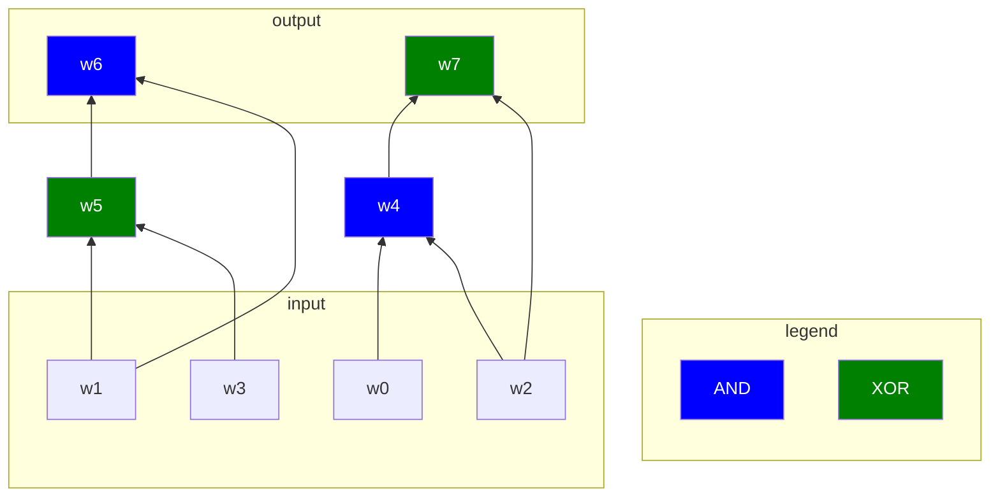

The **Quicksilver protocol** is a modern, highly efficient zero-knowledge proof system designed to work over **boolean circuits** using **VOLE-based commitments**. Introduced in 2021 in the paper

[QuickSilver: Efficient and Affordable Zero-Knowledge Proofs for Circuits and Polynomials over Any Field](https://eprint.iacr.org/2021/076.pdf)

Its core idea is simple and powerful: we represent a computation as a boolean circuit, commit to all wire values using a VOLE-based scheme, and then **prove the correctness of each AND gate**, while letting the verifier handle XOR gates directly (thanks to homomorphic properties). If that sounds abstract, don’t worry, it will make perfect sense by the end of this article.

Unlike traditional SNARKs and STARKs which operate over arithmetic circuits and rely on expensive cryptography, like pairings and polynomial commitment schemes, Quicksilver stays at the bit level and avoids FFTs and elliptic curves. Instead, it uses simple building blocks like OT, VOLE, and GGM trees. This simplicity leads to a major boost in prover efficiency.

Compared to garbled circuits, which require transmitting full ciphertexts for each gate, Quicksilver offers similar functionality with drastically lower communication. This makes it a great fit for bandwidth-sensitive or large-scale MPC settings. That’s why [mpz](https://github.com/privacy-scaling-explorations/mpz) recently [implemented QuickSilver](https://github.com/privacy-scaling-explorations/mpz/pull/198) to improve performance.

Let’s dive into this sorcery… 🪄

## Bristol circuits: formatted boolean circuits

As the name suggests, in boolean circuits we’ll work bit by bit.

A **Boolean circuit** is a way to represent a computation using only binary operations, that is, logic gates like **AND**, **XOR**, and **NOT**.

Instead of thinking in terms of arithmetic over fields, you can imagine a program as a sequence of logic gates that take **bits as input** and produce **bits as output**.

At a high level:

- Inputs and outputs are all in $\mathbb{F}_2$
- The circuit is made up of layers of logic gates
- Each gate computes a simple function like:
  - **AND**: $a \wedge b$
  - **XOR**: $a \oplus b$
  - …

For example, a circuit that adds two 4-bit numbers would take 8 input bits, and produce a 5-bit result (the sum + carry). All intermediate steps, like carries and bitwise operations, are represented using logic gates.

Circuits are typically **acyclic** (no loops).

Boolean circuits are fundamental in:

- **Secure computation** (ex: garbled circuits)
- **Zero-knowledge proofs**
- **Hardware design** (ex: digital logic, FPGA programming)

Note that in zkp, boolean circuits are often “extended” to arithmetic circuits, with field elements instead of bits. This is much more practical because boolean circuits are overly complicated when representing arithmetic operations.

### Bristol Fashion Circuits

When working with Boolean circuits in practice, especially for secure computation, we need a **standard format** to describe them precisely and efficiently.

**Bristol Fashion** is a **file format** and **convention** for describing Boolean circuits using only a small set of logic gates, typically **XOR**, **AND**, and optionally INV, NOT and EQ.

It was introduced to make Boolean circuits easy to parse and reusable across different protocols.

A Bristol Fashion circuit description is a plain-text file with two main sections:

1. **Header** defines:

   - Number of gates
   - Number of wires
   - Number of inputs + length of each input
   - Number of outputs + length of each output

   Example:

   ```
   5 7
   3 2 4 6
   1 8
   ```

   This means:

   - 5 gates
   - 7 wires
   - 3 inputs: first of length 2 bits, second is 4 bits, third is 6 bits
   - 1 output of bits

2. **Gate descriptions,** one per line:

   Each line describes:

   - Number of input wires
   - Number of output wires
   - Input wire indices
   - Output wire indices
   - Gate type (`AND`, `XOR`, or `INV`)

   ```
   2 1 4 5 6 AND
   2 1 7 8 9 XOR
   ...
   ```

   The first line means: AND gate, with 2 inputs (indices 4 and 5) and 1 output (index 6).

### Example

Here’s a simple Bristol Fashion circuit for computing:

$$
out = (a \wedge b) \oplus c
$$

Where each input is 1 bit

```
2 5
3 1 1 1
1 1
2 1 0 1 3 AND
2 1 2 3 4 XOR
```

Explanation:

- 2 gates, 5 wires
- 3 inputs of 1 bit each
- 1 output of 1 bit
- first gate: AND, 2 inputs at indices 0 and 1, outputs result at index 3
- second gate: XOR inputs at 2 and 3, result at index 4

### Why Use Bristol Fashion?

- **Standardized**: Easy to integrate into many cryptographic tools
- **Compact**: Represents only the essential logic
- **Language-agnostic**: Can be parsed from any language or platform

It’s a foundational format used in projects like TLS Notary (mpz), MP-SPDZ, and some zero-knowledge compilers. Many tools can convert high-level code (like C or Python) into Bristol Fashion format using circuit compilers.

## Gates

When working with VOLE-based protocols, you'll often see **ADD** and **MUL** gates.

But when you break things down bit by bit (boolean circuits), these are equivalent to the more familiar **XOR** and **AND** gates.

Let’s explore this equivalence.

### XOR = ADD (mod 2)

In binary, addition modulo 2 behaves exactly like XOR. Here's a truth table showing this:

| input 1 | input 2 | XOR | addition (mod 2) |
| ------- | ------- | --- | ---------------- |
| 0       | 0       | 0   | 0                |
| 0       | 1       | 1   | 1                |
| 1       | 0       | 1   | 1                |
| 1       | 1       | 0   | 0                |

Here’s a quick Python snippet to demonstrate it in practice:

```python
import random

def binary(v):
	return list(map(int, f"{v:08b}"))

a = binary(random.randint(0, 127))
b = binary(random.randint(0, 127))

ADD = [(a[i] + b[i]) % 2 for i in range(8)]
XOR = [a[i] ^ b[i] for i in range(8)]

assert ADD == XOR
```

### AND = MUL (mod 2)

Similarly, a bitwise AND is equivalent to multiplication in $\mathbb{F}_2$. Here’s the truth table:

| input 1 | input 2 | AND | multiplication |
| ------- | ------- | --- | -------------- |
| 0       | 0       | 0   | 0              |
| 0       | 1       | 0   | 0              |
| 1       | 0       | 0   | 0              |
| 1       | 1       | 1   | 1              |

And again, a quick check in Python:

```python
import random

def binary(v):
	return list(map(int, f"{v:08b}"))

a = binary(random.randint(0, 127))
b = binary(random.randint(0, 127))

MUL = [(a[i] * b[i]) % 2 for i in range(8)]
AND = [a[i] & b[i] for i in range(8)]

assert MUL == AND
```

This is especially relevant in _subfield VOLE_, where the prover's values lie in $\mathbb{F}_2$, so the circuit operates using simple boolean gates like AND and XOR. Even if the underlying VOLE protocol runs over a larger field like $\mathbb{F}_{2^k}$ the logic of the computation remains bitwise, each gate handles individual bits, not field elements.

## Our circuit

Let’s now look at a concrete example: a small Boolean circuit that performs a few **XOR** and **AND** operations on two 2-bit inputs.

We’ll use this as a running example to illustrate how VOLE can be used to evaluate circuits securely.

To keep things clear: we'll call the two 2-bit inputs $a=(w_0,w_1)$ and $b=(w_2,w_3)$. We use the letter `w` for **wire values**, short for "witness".

### Circuit diagram

Here’s a visual representation using a flow-style logic graph:



> ⚠️ Sorry, the wires may appear in a weird order, that’s due to Mermaid, and I either can’t control it or don’t know how to 😊

### Bristol fashion format

Here’s the same circuit in **Bristol Fashion** format:

```
4 8
2 2 2
1 2

2 1 0 2 4 AND
2 1 1 3 5 XOR
2 1 1 5 6 AND
2 1 2 4 7 XOR
```

Breakdown:

- 4 gates, 8 wires
- 2 inputs of 2 bits each
- 1 output of 2 bits

The gate descriptions match the logic shown in the graph, and can be written algebraically as:

$$
w_4 = w_0 \wedge w_2 \\
w_5 = w_1 \oplus w_3 \\
w_6 = w_1 \wedge w_5 \\
w_7 = w_2 \oplus w_4 \\
$$

### Python code

And here’s how you could implement the circuit in plain Python:

```python
def circuit(a, b):
	w0, w1 = a
	w2, w3 = b

	w4 = w0 & w2 # AND gate
	w5 = w1 ^ w3 # XOR gate

	w6 = w1 & w5 # AND gate
	w7 = w2 ^ w4 # XOR gate

	return [w6, w7]
```

This small circuit will be the base we use to explore how VOLE enables private, efficient circuit evaluation, gate by gate, without ever revealing the underlying inputs.

You’re ready?

## Prove

The first step in the protocol is to **commit to all input wires** using VOLE commitments. Then, for every **AND gate** in the circuit, we also commit to its output.

The verifier’s job is to **check that each committed output actually corresponds to an AND of its inputs,** without learning any of the underlying wire values.

We don’t need to commit to the outputs of XOR gates, the commitments are **additively homomorphic**, so the verifier can compute XOR outputs directly from the committed inputs.

💡 **Reminder**: The structure of the circuit (its wiring) is public. Both prover and verifier know which wires go into each AND or XOR gate.

### Verifying an AND gate

Let’s walk through how the verifier checks that a **MUL gate** (AND) was computed correctly.

Take the first AND gate in our example circuit. We compute:

$$
w_4=w_0 \cdot w_2
$$

Each wire has a VOLE commitment of the form:

$$
k_i=m_i + w_i \cdot \Delta
$$

So:

- Compute the product of the input commitments

$$
\begin{aligned}
k_0 \cdot k_2 &= (m_0 + w_0 \cdot \Delta) \cdot (m_2 + w_2 \cdot \Delta) \\
&= (m_0 \cdot m_2) + (m_0 \cdot w_2 + m_2 \cdot w_0) \cdot \Delta + (w_0 \cdot w_2) \cdot \Delta^2
\end{aligned}
$$

- Multiply the output commitment by $\Delta$:

$$
k_4 \cdot \Delta = (m_4 + w_4 \cdot \Delta) \cdot \Delta
$$

- Subtract:

$$
k_0 \cdot k_2 - k_4 \cdot \Delta = (m_0 * m_2) + (m_0 \cdot w_2 + m_2 \cdot w_0 - m_4) \cdot \Delta + (w_0 \cdot w_2 - w_4) \cdot \Delta^2
$$

if $w_0 \cdot w_2=w_4$, then the $\Delta^2$ term disappears, and we’re left with a linear expression in $\Delta$:

$$
k_0 \cdot k_2 - k_4 \cdot \Delta \stackrel{?}{=} (m_0 \cdot m_2) + (m_0 \cdot w_2 + m_2 \cdot w_0 - m_4) \cdot \Delta
$$

Now the verifier can:

- compute the left-hand side himself from public commitments
- receive the **right-hand side coefficients** from the prover
- check that the identity holds

By the **Schwartz-Zippel lemma**, the probability that a false statement passes this check is at most $\frac{2}{|\mathbb{F}|}$, which is negligible over a large field.

### Batching multiple gates

Instead of checking each gate individually, we can **batch** all checks together using a **random linear combination** (RLC).

In our circuit, we have 2 gates:

$$
K_1=k_0 \cdot k_2 - k_4 \cdot \Delta \\
K_2=k_1 \cdot k_5 - k_6 \cdot \Delta
$$

$K_i$ represents the left-hand side of the above equation.

The verifier will want to check:

$$
K_1 = M_1+W_1*\Delta \\
K_2 = M_2+W_2*\Delta
$$

Where:

- $M_i=m_a \cdot m_b$
- $W_i = m_a w_b + m_b w_a - m_{out}$

So:

$$
\begin{aligned}
M_1 &= (m_0 * m_2) \\
W_1 &= (m_0 * w_2 + m_2 * w_0 - m_4) \\
\\
M_2 &= (m_1 * m_5) \\
W_2 &= (m_1 * w_5 + m_5 * w_1 - m_6)
\end{aligned}
$$

The verifier sends a random scalar $\chi$, and checks:

$$
\chi \cdot K_1 + \chi^2 \cdot K_2 \stackrel{?}{=} (\chi M_1 + \chi^2 M_2) + (\chi W_1 + \chi^2 W_2) \cdot \Delta
$$

This way, the prover only needs to send:

$$
M = \chi M_1 + \chi^2 M_2 \\
W = \chi W_1 + \chi^2 W_2
$$

Just **two field elements**, regardless of how many AND gates we check.

## How to Make It Zero-Knowledge?

So far, we’ve seen how to prove the correctness of a circuit, but we haven’t ensured **zero-knowledge**. The verifier receives values like $M$ and $W$, which depend on the witness, so they could potentially reconstruct parts of it.

To prevent this, we need to **mask the witness** using randomness, so the verifier learns nothing beyond the validity of the proof.

### Adding Randomness with a VOLE Correlation

We generate a random VOLE correlation:

$$
r_k=r_w * \Delta + r_m
$$

These values are completely independent of the witness.

Now, we use them to hide our actual proof values:

$$
M_{hidden} = r_m - M \\
W_{hidden} = r_w - W \\
K_{hidden} = r_k - K
$$

This way, the prover only sends masked values, and the verifier **can no longer learn anything about** $M$, $W$, or the underlying witness.

### Verifier’s check

Even though the values are masked, the verifier can still check the core equation:

$$
K_{hidden} \stackrel{?}{=} W_{hidden} * \Delta + M_{hidden}
$$

If the original values satisfied the equation, the masked values will too. And thanks to the fresh randomness from the VOLE correlation, they reveal nothing.

This simple trick gives us **zero-knowledge for free** from the VOLE functionality.

## Show me the code!

You’ll find a full example, with comments, on how the procotol is run on the mpc-by-hand repo: https://github.com/teddav/mpc-by-hand/blob/master/quicksilver.sage

## Sources

https://eprint.iacr.org/2021/076.pdf

https://blog.chain.link/vole-based-zk/

https://www.youtube.com/watch?v=U30lzH0k5f8
