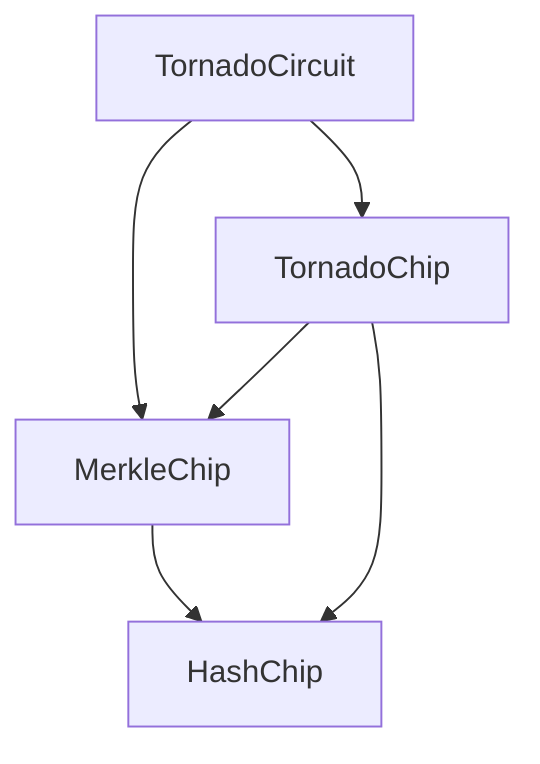

tl; dr: You already heard of Tornado Cash? And Halo2? Great! Here we’re going to mix those 2 and re-write the Tornado Cash circuits from Circom to Halo2.

Ok, let’s have a bit of a better intro…

“Zero Knowledge” is definitely a scary word (or 2 words)! When I started learning about it a few months ago I couldn’t understand anything 🤯

Recently I started to learn about Halo2, and after reading a bit of code and [a few](https://zcash.github.io/halo2/index.html) [tutorials](https://erroldrummond.gitbook.io/halo2-tutorial/) I tried to write my own circuit but was completely stuck: I had no idea how to do it...

That’s why I decided to write this article: to learn how to write a circuit, and teach some other people at the same time. Hopefully you’ll learn something from it.

This article may need to be corrected, or some things I’m saying might be completely wrong. If so: please message me so I can fix it (and improve myself at the same time 😄).

Let’s review where I am when starting this project:

- read a few Halo2 tutorials
- I think I understand what Chips and Circuits are, I have no idea what Layouter and Regions are for
- I don’t know how to write my own circuit
- I definitely don’t understand how things work “underneath”. Like how the proof is generated from the “halo2 board”

This is “part 1”. We’re going to start easy with an implementation as simple as possible, and the next parts will improve on it. I haven’t written part 2 (or 3, or…) yet, so if you’re here a few weeks/months from now and they are not published, it means I gave up 🥲 so you’re allowed to send me a twitter message and tell me you’re disappointed.

Here’s our plan for today:

- i’ll give you a quick reminder on how tornado cash works
- what is halo2?
- how are we going to design our circuits
- let’s code

# Tornado Cash core

If you’re here, you probably already know what Tornado Cash is. If not → [What is Tornado Cash?](https://letmegooglethat.com/?q=tornado+cash)

We are going to rewrite the “original” Tornado. Not [Tornado Nova](https://github.com/tornadocash/tornado-nova). Nova is a newer version which is really interesting too but more complicated, so won’t look into it for now.

This is the repo we’re going to look at: [Tornado core](https://github.com/tornadocash/tornado-core).

Tornado has 2 parts: circuits and smart contracts. We’ll only focus on the circuits here (though we might take a quick peek at the contracts for general understanding).

Circuits were written with [Circom](https://iden3.io/circom) and that’s what we’re going to change. We’ll rewrite those circuits with [Halo2](https://github.com/privacy-scaling-explorations/halo2), the [PSE](https://pse.dev/) implementation (the KZG one, i’ll tell you more about it in the next section).

Ok thanks, but… how does it work? It’s actually really easy…

## The “private” numbers

Everything is secured by only 2 numbers called a `secret` and a `nullifier`. That’s it.

Those 2 numbers alone are **the only things keeping you from stealing the millions of ethers deposited in the tornado pools** 😱

When you deposit money into Tornado, you need to generate a random secret and a random nullifier. Those numbers can go up to `21888242871839275222246405745257275088548364400416034343698204186575808495617` (see [here](https://docs.circom.io/background/background/) or [here](https://github.com/tornadocash/tornado-core/blob/1ef6a263ac6a0e476d063fcb269a9df65a1bd56a/contracts/MerkleTreeWithHistory.sol#L20-L21)) Yes it’s a big number, it’s more than $2^{253}$.

Keep those numbers written in a secured location, you’re going to need them when you want to withdraw your money.

Tornado can be reduced to only 2 steps:

- depositing
- withdrawing

Let’s see them in more details.

## Deposit

When you make a deposit, of course you have to send X ethers (depending on the pool) but you also have to [send a `commitment`](https://github.com/tornadocash/tornado-core/blob/1ef6a263ac6a0e476d063fcb269a9df65a1bd56a/contracts/Tornado.sol#L55).

This commitment is just a hash of the previous 2 numbers: `commitment = H(nullifier, secret)`.

Tornado uses a merkle tree to [store those commitments](https://github.com/tornadocash/tornado-core/blob/1ef6a263ac6a0e476d063fcb269a9df65a1bd56a/contracts/MerkleTreeWithHistory.sol#L68). Again, I’m sorry 🙏 but I’m too lazy to explain to you what a merkle tree is. If you don’t know → Google.

A great way to see how it’s done is looking at the frontend/cli that was written by the Tornado devs. These are the tools most people used (still use?) to deposit money into Tornado.

Here we have the [deposit() function](https://github.com/tornadocash/tornado-cli/blob/378ddf8b8b92a4924037d7b64a94dbfd5a7dd6e8/cli.js#L221) of the cli, where the deposit is created

```jsx
const deposit = createDeposit({
  nullifier: rbigint(31),
  secret: rbigint(31),
});
```

and the [createDeposit()](https://github.com/tornadocash/tornado-cli/blob/378ddf8b8b92a4924037d7b64a94dbfd5a7dd6e8/cli.js#L164) where you can clearly see how the commitment is a hash of `nullifier + secret`

```jsx
function createDeposit({ nullifier, secret }) {
  const deposit = { nullifier, secret };
  deposit.preimage = Buffer.concat([deposit.nullifier.leInt2Buff(31), deposit.secret.leInt2Buff(31)]);
  deposit.commitment = pedersenHash(deposit.preimage);
  deposit.commitmentHex = toHex(deposit.commitment);
  deposit.nullifierHash = pedersenHash(deposit.nullifier.leInt2Buff(31));
  deposit.nullifierHex = toHex(deposit.nullifierHash);
  return deposit;
}
```

You can see how the random numbers are generated

```jsx
const rbigint = (nbytes) => snarkjs.bigInt.leBuff2int(crypto.randomBytes(nbytes));
```

The numbers are 31 bytes long, which means up to $2^{248}$, which is less than the max we saw earlier ($2^{253})$. So we’re good!

## Withdraw

This is where it becomes interesting. How do we withdraw our money?!

Obviously we’re going to use a zk proof:

- to prove that we know the secret and the nullifier, but without revealing them
- to prove that our commitment is in the merkle tree

### Nullifier

But what is the nullifier used for exactly?

We need a way to ensure that a deposit is only withdrawn once. That’s what it’s for. When a withdrawal is made, the [hash of the nullifier is stored in the contract](https://github.com/tornadocash/tornado-core/blob/1ef6a263ac6a0e476d063fcb269a9df65a1bd56a/contracts/Tornado.sol#L96), and therefore the commitment is “nullified”, [it can’t be used again](https://github.com/tornadocash/tornado-core/blob/1ef6a263ac6a0e476d063fcb269a9df65a1bd56a/contracts/Tornado.sol#L86).

And why do we use the `nullifierHash`: because we want to make sure the nullifier is always kept private, so we just disclose its hash as a public value. It’s just as unique, and there’s no way to reverse it.

Let’s look at the [withdraw() function](https://github.com/tornadocash/tornado-core/blob/1ef6a263ac6a0e476d063fcb269a9df65a1bd56a/contracts/Tornado.sol#L76). It takes as input the zk proof and the public inputs: root of the tree, nullifier hash, recipient, relayer, fee and refund.

If we look at the [Withdraw circuit](https://github.com/tornadocash/tornado-core/blob/1ef6a263ac6a0e476d063fcb269a9df65a1bd56a/circuits/withdraw.circom#L30) you’ll see that these are the same public inputs. The private inputs are:

- the secret
- the nullifier
- the merkle tree inputs, which are kept private so that we don’t know which leaf of the tree is being withdrawn

## More details

Wow… those explanations were longer than what I wanted to. At least now you should have a clear picture of how it works. I left out some features that are important but we’ll (maybe) come back to them when writing our own circuits.

For now, if you want more details check those links:

[Understanding Zero-Knowledge Proofs Through the Source Code of Tornado Cash](https://betterprogramming.pub/understanding-zero-knowledge-proofs-through-the-source-code-of-tornado-cash-41d335c5475f)

[Rareskills - How Tornado Cash Works](https://www.rareskills.io/post/how-does-tornado-cash-work)

# Why Halo2?

Tornado zk circuits were written using Circom and the Groth16 proving system. You can look at the circuit compile scripts in [package.json](https://github.com/tornadocash/tornado-core/blob/1ef6a263ac6a0e476d063fcb269a9df65a1bd56a/package.json#L7) and at the [generateProof](https://github.com/tornadocash/tornado-core/blob/1ef6a263ac6a0e476d063fcb269a9df65a1bd56a/src/cli.js#L172) function.

One of the main issues with Groth16 is that it requires a circuit-based trusted setup. Which is annoying, and reduces trust. Then **Plonk** was created and allowed for a universal trusted setup. There are some limits, but basically: we do it once, and everybody can write circuits based on the same setup.

That’s it, let’s keep the explanations to the minimum 😊

Halo2 is a proving system [created by Zcash](https://electriccoin.co/blog/explaining-halo-2/) based on top of Plonk and somehow makes it better/more efficient (I guess…). I’m not smart enough (yet 😉) to understand exactly why it’s so good, but some really smart people told me it’s good, so I’m just going to trust them.

So… today we’re going to use Halo2 to rebuild Tornado Cash.

As I said at the beginning, I’m actually writing this article as a way to learn Halo2. I have no idea how it works 😂 So I’m learning along the way.

# Circuit design

As we just saw, the Tornado circuit is actually pretty simple. We only need 2 building blocks:

- hashing
- merkle tree

These are what we call “chips” in Halo2, they are like classes, or the equivalent of `template` in circom. You can reuse them when needed in other chips or circuits.

Ok… before going any further I have something to disclose. A lot of the code that I’m going to show you next, I haven’t written it myself. Most of the Hash chip and the Merkle chip are “heavily inspired” (ok… mostly copied) from https://github.com/summa-dev/halo2-experiments

(which is itself “inspired” by https://github.com/jtguibas/halo2-merkle-tree 😁). So we can say thanks to [Enrico](https://twitter.com/backaes), [Jin](https://twitter.com/Sifnoc) and [John](https://twitter.com/jtguibas).

But since I’m writing this long article to explain everything, I guess that makes up for it!

## HashChip

This chip takes 2 values and hashes them together.

In this part1 we’re going to use a “fake” hash function, in order to make things simple. I’ll give you more details in the next part when we start coding.

To be represented correctly in Halo2 we’re going to need 3 advice columns (our private values, the witness), 1 instance column (our public value, the resulting hash) and 1 selector. And we’ll use only 1 row.

Let’s say we want to hash together the word “hello” and “tornado” and that the hash ends up being “thoerlnlaodo”

| Advice 1 | Advice 2 | Advice 3     | Instance     | Selector |
| -------- | -------- | ------------ | ------------ | -------- |
| hello    | tornado  | thoerlnlaodo | thoerlnlaodo | 1        |

What’s happening? The result of the hash is computed during proving (into “Advice 3”), but it was also passed by the prover as a public input in “Instance” (obviously the prover knows all the values, so he can compute the hash himself). Then, the circuit applies a constraint on the values and make sure that `advice3 == instance`. That’s how we prove that we know the 2 initial values (”hello” and “tornado”) which result in the hash “thoerlnlaodo”.

In reality, strings don’t exist in circuits. Everything is a number.

## MerkleChip

Next we need a chip to compute/constrain our merkle tree. This chip is going to be a bit more complicated.

| advice1 | advice2 | advice3
(swap bit) | swap selector | bool selector |
| --- | --- | --- | --- | --- |
| leaf | neighbor | 1 | 1 | 1 |
| left | right | hash | 0 | 0 |

We still have 3 advice columns but we need 2 rows this time.

First row will take the hashes of the 2 nodes. Then the swap bit will tell us if the nodes are in the right order (left and right) or need to be swapped. On the next row, we have the nodes in the right order, so we only need to hash them. To get to the root of the tree, we just do that in a loop, and once we get to the root we compare it with the root passed as public input.

## Circuits

In the code you’re going to see a HashCircuit and a MerkleCircuit. These are not used for our Tornado circuit. They are just here to test and understand better how circuits work.

The important part is our Tornado circuit. It’s going to take as private inputs:

- nullifier
- secret
- path elements
- path indices

The public inputs will be:

- nullifier hash
- merkle root

That’s it, I think we’re ready to dive into the code!

Just a quick summary of the relations in the circuit.



# Code

[Here’s the final code](https://github.com/teddav/tornado-halo2/tree/part1), so you can follow along and run it yourself.

## Hash

As explained in the previous part, a Chip is like a class. There is a `Chip` trait in `halo2_proofs::circuit` but you don’t necessarily have to follow it, you can just write your chip the way you want it.

Circuits are different. In order to generate your proof correctly, you’ll have to follow the

`halo2_proofs::plonk::Circuit` trait.

[Our chip](https://github.com/teddav/tornado-halo2/blob/part1/src/chips/hash.rs) takes a “config” which means a description of the columns you’re going to use (see the table above).

```rust
pub struct HashConfig {
    pub advice: [Column<Advice>; 3],
    pub instance: Column<Instance>,
    pub hash_selector: Selector,
}
```

### Our first gate

Then we write our chip and the function `configure()` that’s where we define our polynomial constraint.

I’m still not sure what `enable_equality` is for, but I think it enables you to setup copy constraints later in your circuit. Every example I saw of halo2 had that, so I just copied it. You’re right, it’s not that smart… 🤔 Remind me to come back to it in part 2 and give a better explanation.

```rust
meta.create_gate("hash constraint", |meta| {
	let s = meta.query_selector(hash_selector);
	let a = meta.query_advice(advice[0], Rotation::cur());
	let b = meta.query_advice(advice[1], Rotation::cur());
	let hash_result = meta.query_advice(advice[2], Rotation::cur());
	vec![s * (a * b - hash_result)]
});
```

In order to understand this code, first I have to tell you how I cheated. Instead of writing an actual hash function, I wrote something really stupid. Our hash function takes 2 values and multiplies them to return a hash (remember that every value is a number). If I had to write it in python it would be:

```python
def hash(a, b):
	return a * b
```

Again, I promise in part 2 I’ll improve this. We’ll use the Poseidon hash and everything is going to look really nice 😎

Let’s try to explain everything once, so it will be easier for the next gates.

Currently our gate looks like this: `s * (a * b - hash_result) = 0` which can be translated to: multiply `a` and `b` and subtract `hash_result` , if that equals 0 we’re good. Otherwise the `hash_result` is wrong.

`s` is what we call a “selector”, it’s a boolean that’s going to activate or not the constraint. If it’s `0` then the result is 0 so the constraint passes, and we don’t need to make sure `a*b = hash_result`. If it’s `1` then `a*b` must equal `hash_result`.

In order to get values `a` and `b` we use

```rust
let a = meta.query_advice(advice[0], Rotation::cur());
```

Which means: get the first row (`Rotation::cur()`) or the first advice column (`advice[0]`). That’s how things always work in halo2: columns and rows. If you wanted to access previous or next rows you could have done `Rotation::prev()` or `Rotation::next()` for example.

### Regions and Layouter

Again, I’m going to tell you how I think of it. It might not be the best representation (but hopefully it’s not wrong…), but that’s how I understand Halo2 for now. For part 2, I’ll try to ask some other people to help me visualise it better and I’ll give you another perspective.

Halo2 represents everything in a big table (like an Excel spreadsheet). You can use that table however you want, but it can quickly get messy (that’s why we have regions).

Of course there is also a cost when generating the proof: each new column that you’re using is more expensive, while rows are cheaper. But remember that any new cell you’re using means more computing power.

Going back to our Excel comparison, if you want to compute the sum of 5 numbers, you could write your 5 numbers in B5 to B9, and then write a “sum()” formula in C4. If you wanted to use the sum result somewhere else in the table, let’s say “F15”, so you’d just use a reference to cell C4.

Halo2 works the same, you just assign values to cells, and then you reference them. To make things more efficient, everything has to be divided into regions, which are blocks of cells. So you define a new region, and in this region you automatically have access to the advice/instance columns that you pre-defined. You fill your cells and know that your constraints (that you added in `configure()`) will be enforced.

You can also add new constraints, and even constrain cells between regions! Wow that’s awesome 😍

The layouter is just a helper to create regions. In the background it optimises how regions are created so that they don’t overlap, and so that the cost is as low as possible. When you want a new region, you ask the layouter for it `layouter.assign_region` and then you can just use it without worrying about messing things up on the board.

### Hash it

Now we can look at the `hash()` function which is a bit more complicated.

The function signature is

```rust
fn hash(
	&self,
	mut layouter: impl Layouter<F>,
	left_cell: AssignedCell<F, F>,
	right_cell: AssignedCell<F, F>,
) -> Result<AssignedCell<F, F>, Error>
```

`left` and `right` could be values, and it would make the function a bit simpler. But being `AssignedCell` makes the function more generic, and we can now use a ref to any cell on the board.

First we assign a region

```rust
layouter.assign_region( || "hash row", |mut region| {
```

then we copy the value in the left cell to our first advice column (first row)

```rust
left_cell.copy_advice(
	|| "copy left input",
	&mut region,
	self.config.advice[0],
	0,
)?;
```

same for the right cell to second advice column and compute the hash in third advice column

```rust
let hash_result_cell = region.assign_advice(
	|| "output",
	self.config.advice[2],
	0,
	|| left_cell.value().cloned() * right_cell.value().cloned(),
)?;
```

Finally we return a reference to the cell where the hash is computed.

### Hash circuit

Imagine that someone publicly revealed a hash `H` and you want to prove that you know 2 values `a` and `b` that when hashed together will give `H`. But of course you want to keep a and b private.

For that, we look at [the Hash circuit](https://github.com/teddav/tornado-halo2/blob/part1/src/circuits/hash.rs).

It takes our 2 private inputs `a` and `b`

```rust
pub struct HashCircuit<F> {
    pub a: Value<F>,
    pub b: Value<F>,
}
```

And our public input is our hash `H` = `a * b`

```rust
let public_inputs = vec![Fp::from(a * b)];
```

In a circuit, the most interesting part happens in the `synthesize` function. Since our `hash` function takes cells as input, we’re going to create a temporary region that’s going to hold our `a` and `b` values, and then pass the cells to be hashed.

```rust
let (left, right) = layouter.assign_region(
	|| "private inputs",
	|mut region| {
		let left = region.assign_advice(
			|| "private input left",
			config.advice[0],
			0,
			|| self.a,
		)?;

		let right = region.assign_advice(
			|| "private input right",
			config.advice[1],
			0,
			|| self.b,
		)?;

		Ok((left, right))
	},
)?;

let chip = HashChip::construct(config);
let hash_result_cell = chip.hash(layouter.namespace(|| "hasher"), left, right)?;
```

And the most important part is the last line

```rust
layouter.constrain_instance(hash_result_cell.cell(), config.instance, 0)
```

That’s where we set our constraint. `instance` is the column where our public inputs are. Here we make sure that the resulting hash which is in `hash_result_cell` is equal to the hash `H` we publicly displayed.

## Merkle

Now let’s go into the [MerkleChip](https://github.com/teddav/tornado-halo2/blob/part1/src/chips/merkle.rs#L24). This should be faster since we already understood all the foundations.

When we pass values to our `hash` function, the order in which we pass `a` and `b` is important `H(a,b) != H(b,a)`. Right now our current hash function is really dumb, so the order of the values `a` and `b` does not matter (we are just multiplying them). But when we will “upgrade” it and start using Poseidon it will matter.

For our merkle tree we’ll pay attention to the order of the nodes (left/right). That’s why we need a `swap_bit`: are the nodes in the correct order, or do they need to be swapped before being hashed? We also need 2 selectors to go with it:

- swap_selector: check the swap bit → swap or not
- swap_bit_bool_selector: the swap bit should be a boolean, so this checks that the swap bit is `0` or `1`

### Gates

Our [first gate](https://github.com/teddav/tornado-halo2/blob/part1/src/chips/merkle.rs#L46) checks that the swap bit is 0 or 1. This can be re-written as

```python
def is_zero_or_one(value):
	return value * (1 - value) == 0
```

The [second gate](https://github.com/teddav/tornado-halo2/blob/part1/src/chips/merkle.rs#L55) is more complex, but it’s not that complicated 😊 I’ll leave it to you to try to understand it. Just to make sure it’s clear:

`left[0]` means left column, row 0

`left[1]` means left column, row 1

And that’s what we’re checking

```python
if swap_bit == 1:
	return left[0] == right[1] and right[0] == left[1]
else:
	return left[0] == left[1] and right[0] == right[1]
```

That’s the actual constraint

```rust
let constraint1 = (right[0] - left[0]) * swap_bit + left[0] - left[1];
let constraint2 = (left[0] - right[0]) * swap_bit + right[0] - right[1];
```

### Compute the merkle tree

Now that our gates are in place, we need to compute the merkle tree root. In `merkle_prove_layer` :

- we assign our left and right nodes on row 0
- we check the swap bit
- on row 1 we assign left and right (in the correct order this time)
- we hash the nodes
- we return the cell where the hash result is

In `prove_tree_root` we just loop over each layer until we reach the root.

Again, there is a MerkleCircuit where you can see it in action.

The most important part is

```rust
layouter.constrain_instance(root_cell.cell(), config.instance, 1)?;
```

That’s where we validate that the root we computed in the circuit is equal to the root we passed as a public input.

## Tornado circuit

And… finally! We arrive to our [Tornado circuit](https://github.com/teddav/tornado-halo2/blob/part1/src/main.rs). Here are the private inputs

```rust
pub struct TornadoCircuit<F> {
    nullifier: Value<F>,
    secret: Value<F>,
    path_elements: Vec<Value<F>>,
    path_indices: Vec<Value<F>>,
}
```

And the public inputs

```rust
let public_input = vec![nullifier_hash, root];
```

We are not fully respecting the real [Tornado circuit](https://github.com/tornadocash/tornado-core/blob/master/circuits/withdraw.circom#L29) which also takes as public input:

- recipient
- relayer
- fee
- refund

These values are definitely important in the zk proof and should be checked when verifying the proof, but these are useless for our current understanding of Halo2. So won’t bother using them.

Here are the steps taken in the circuit:

- compute the nullifier hash
- check that it matches the public nullifier hash
- compute the merkle tree root
- check that it matches the public merkle root

That’s it. Really easy.

### Range check (not)

I haven’t set up any gate in the TornadoChip, which is a mistake because our circuit will be “under-constrained”.

We should definitely range check our private inputs. Range check means checking that a value is within a certain range, so between a lower bound and an upper bound. But again, let’s keep that for “part 2”.

Here is the [range check in the original Tornado circuit](https://github.com/tornadocash/tornado-core/blob/master/circuits/withdraw.circom#L14): checking that `nullifier` and `secret` are less that 248 bits, which means less than $2^{248}$.

### Nullifier hash and commitment

In the TornadoChip you’ll find a helper [compute_hash](https://github.com/teddav/tornado-halo2/blob/main/src/chips/tornado.rs#L54) function. This makes the nullifier hash and the commitment easier to compute.

This time everything should be easy to understand, so I’m not going to give too much explanations.

Just a comment on the most important constraints:

```rust
layouter.constrain_instance(nullifier_hash_cell.cell(), config.clone().instance, 0)?;
layouter.constrain_instance(merkle_root_cell.cell(), config.clone().instance, 1)?;
```

First we make sure the nullifier hash matches the first row of our instance column (our public inputs), and then we also validate the merkle root against the second row.

And just like that, we have our Halo2 Tornado Cash! 🥳🥳

# What’s next

I mentioned a lot “part 2” because I wanted to keep this first part as simple as possible. Here’s what we need to do to improve our circuit:

- use a real hash function → Poseidon
- range check the values

And to get a deeper understanding of Halo2, we could try to actually generate the proof, and generate the verifier solidity contract, so that we have a fully functioning Tornado Cash.

I have no idea how to do that yet 😂

PLEASE! If you have some ideas or advice, or if some parts of this article need to be improved → [send me a message](https://twitter.com/0xteddav).
