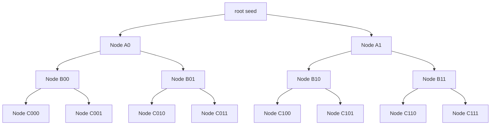
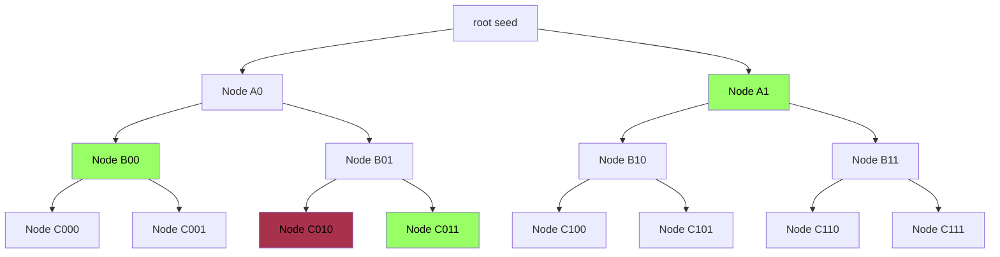

Thanks a lot to [Geoffroy Couteau](http://geoffroycouteau.fr/) who helped me a lot in understanding some of these constructions


## OLE

**Oblivious Linear Evaluation** (OLE) is a cryptographic protocol in which two parties interact to compute an affine function without revealing their private inputs. Specifically:

- the sender holds two values: $w,m \in \mathbb{F}$, where $\mathbb{F}$ is a finite field
- the receiver holds a value $\Delta \in \mathbb{F}$

At the end of the protocol, the receiver learns the result of the affine function evaluated at $\Delta$

$$
k=w*\Delta+m
$$

However, the receiver learns nothing about $w$ and $m$ beyond the result, and the sender learns nothing at all, not even the receiver's input $\Delta$.

Another way to describe this is **private affine function evaluation**: the receiver learns the output of a function defined by the sender, without learning the function itself.

OLE can be seen as a generalization of **Oblivious Transfer (OT)** over larger fields.

In the special case where $\mathbb{F} = \mathbb{F}_2$, OLE behaves like a 1-out-of-2 OT. The sender chooses two values: $v_0,v_1 \in \mathbb{F}_2$

- $w=v_1-v_0$
- $m=v_0$

Which gives the OLE equation:

$$
k=(v_1-v_0) * \Delta + v_0
$$

Then the receiver, holding a selector bit $\Delta \in \{0,1\}$, receives:

$$
k=\begin{cases}
   v_0 &\text{if } \Delta=0 \\
   v_1 &\text{if } \Delta=1
\end{cases}
$$

This can be interpreted as choosing between the two values $v_0$ and $v_1$, depending on $\Delta$, just like OT.

OLE has a variety of applications in secure computation, including:

- **Commitment** to a value $w$ (the witness)
- **Secure arithmetic**: enabling two parties to jointly compute multiplications or additions on hidden inputs.

Let’s now explore these two use cases in more detail.

### OLE as a Commitment Scheme

An **Oblivious Linear Evaluation** can be used for the sender (often called the _prover_) to commit to a hidden value $w$, typically a _witness_. This commitment has two key properties:

- **Hiding**: The receiver (or _verifier_) learns nothing about $w$
- **Binding**: Once the commitment is made, the prover cannot change the value of $w$ without being caught.

How does this work?

After performing the OLE protocol, the verifier receives a value $k$ such that:

$$
k = w*\Delta + m
$$

Here, $\Delta$ is a secret value known only to the verifier, and $m$ is a random value held by the prover. You can think of $m$ as a **MAC (Message Authentication Code)**: it masks the value $w$ while still binding it to the commitment.

Because $\Delta$ is hidden from the prover, the probability that they can find another pair $(w',m')$ such that:

$$
k=w'*\Delta+m'
$$

is extremely small, unless they know $\Delta$.

If either $\Delta$ or $k$ is revealed, the security of the commitment collapses. But as long as they remain secret, the commitment is both hiding and binding.

This simple mechanism becomes even more powerful when we consider the **homomorphic** properties of OLE commitments: we can combine them without ever revealing the underlying values.

> Note: In practice, protocols rarely involve just a single OLE. Instead, many OLEs are executed in parallel, all using the same fixed value $\Delta$, chosen by the verifier at the start of the protocol.

### Homomorphic Combination

Suppose the prover has committed to two values $w_1$ and $w_2$ using OLE, resulting in:

$$
k_1 = w_1 * \Delta + m_1 \\
k_2 = w_2 * \Delta + m_2
$$

The verifier can add their commitments:

$$
k = k_1+k_2
$$

And the prover can do the same with their values:

$$
w = w_1+w_2 \\
m = m_1+m_2
$$

Then, the combined commitment still holds:

$$
k = w * \Delta + m
$$

or: $k_1+k_2=(w_1+w_2)*\Delta + (m_1+m_2)$

This additive homomorphism allows commitments to be aggregated or manipulated algebraically **without revealing any private inputs**.

Magic? Almost 🦄

### OLE for Computation on Hidden Values

One really powerful use case of **Oblivious Linear Evaluation** is enabling arithmetic over **hidden inputs**. In other words, two parties can compute basic operations like multiplication or addition **without revealing their private values to each other**.

That said, it’s a bit more subtle than “just compute a + b or a × b”.

In fact, with the help of OLE, you can **transform addition into multiplication**, or vice versa, and that opens up a lot of possibilities.

Let’s walk through how it works, and why that’s useful.

**🔄 M2A / A2M**

In **Multiplication-to-Addition (M2A)**, we want to convert the product of two secret values into **additive shares**: two values that sum to the result, each held privately by a different party.

Let’s say:

- the **sender** (Prover) holds a secret value $a$
- the **receiver** (Verifier) holds a secret value $b$

They want to compute:

$$
a*b=c+d
$$

where $c$ and $d$ are secret shares, one held by the sender and the other by the receiver.

To do this, they perform an **OLE**:

- the sender inputs $a$ (the multiplier) and a random mask $m \in \mathbb{F}$
- the receiver inputs $b$ as the evaluation point

As a result, the receiver learns:

$$
k = a*b+m
$$

Now both parties hold additive shares of $a*b$:

- the **sender** keeps $-m$
- the **receiver** has $k$

So together:

$$
a*b=k-m
$$

Magic: the product is now split into two hidden pieces. No one ever saw both inputs, and yet the result is correct.

How does it work?

You can find a working example in `m2a.py` over at https://github.com/teddav/mpc-by-hand.

Let’s start simple. Suppose you want to compute $a*b$ (no hidden value here). You already know the binary representation of `b`.

You can just do:

```python
import random

p = 257

def to_bin(v):
    return [int(i) for i in list(bin(v)[2:])]

a = random.randint(0, p)
b = random.randint(0, p)
print("a =", a, ", b =", b)
print("a * b =", (a * b))

b_bits = to_bin(b)[::-1]
t = [(a * pow(2, i)) for i in range(len(b_bits))]

tb = [t[i] if bit == 1 else 0 for i,bit in enumerate(b_bits)]
print("tb =", sum(tb))
assert sum(tb) == (a * b)
```

What's going on here?

`b_bits` is the binary representation of `b` (in little endian).

→ so… $t_b$ is just $a*b$ based on the binary representation of `b`

Let’s detail:

$$
a*b=a*\sum_i{b_{\text{bits},i}}*2^i=\sum_i{b_{\text{bits},i}}*a*2^i
$$

or:

$$
\sum_i{b_{\text{bits},i}}*a*2^i=\begin{cases}
   0 &\text{if } b_{\text{bits},i}=0 \\
   a*2^i &\text{if } b_{\text{bits},i}=1
\end{cases}
$$

Say $b=11$, so in binary: $b_{bits}=1011$

That’s:

$$
b_{\text{bits}}=1*2^0+1*2^1+0*2^2+1*2^3
$$

Then:

$$
\begin{aligned}
a*b &= a*(1*2^0+1*2^1+0*2^2+1*2^3) \\
&= a*2^0+a*2^1+a*2^3
\end{aligned}
$$

So we just sum a, shifted accordingly based on which bits of b are 1.

Now we understand how to multiply two numbers using the binary representation of the second.

In M2A, we do pretty much the same thing, but the sender hides their value $a$ using a random mask. Then, using oblivious transfer, the receiver learns the masked version of the relevant $a*2^i$ terms, only for the bits where $b_{\text{bin},i}=1$.

So the multiplication happens, but the inputs stay hidden.

You can follow the script for a full walkthrough. It’s commented and walks you through this logic step by step.

**A2M: opposite direction**

**Addition-to-Multiplication (A2M)** is the inverse of M2A: starting from two **additive shares** of a value, you convert them into **multiplicative shares**. This is useful when a protocol needs multiplicative structure.

**Example 1: MPC-TLS**

M2A and A2M aren’t just academic tricks, they’re used in real-world privacy tools like **MPC-TLS**, the core protocol behind **TLS Notary**.

The goal of MPC-TLS is to allow users to securely prove the content of an HTTPS session, **without revealing sensitive data**.

Let’s recap how a regular TLS handshake works: when your browser connects to a website, it performs a key exchange with the server to agree on a shared encryption key. That key is then used to encrypt all future traffic.

In **MPC-TLS**, there’s a third party: the **Notary**, acting as a proxy. The browser and the notary **each hold a secret share** of the TLS session key, and use MPC techniques to cooperatively compute the handshake and decryption, **without ever revealing their shares to each other**.

M2A and A2M are core primitives here. They allow the browser and notary to securely perform multiplications and additions over secret values as part of the handshake.

If you're curious about how the full protocol works, check out [Section 4.3.1 of this paper](https://arxiv.org/pdf/2409.17670). Once you're familiar with OLE, M2A, and A2M, the rest falls into place.

**Example 2: Private Information Retrieval**

Another great real-world use case for OLE is **Private Information Retrieval (PIR)**.

In a PIR protocol, a user queries a database and gets back the result they wanted **without revealing which item they asked for** 🤯 The database does all the work but stays completely in the dark about what was accessed.

OLE can be used to build efficient PIR schemes where the database holds a vector, and the user interacts with it using arithmetic encodings of their query, without leaking the index.

If you're curious about how this works under the hood, check out [this paper](https://eprint.iacr.org/2017/617.pdf).

## VOLE

A **Vector Oblivious Linear Evaluation** (VOLE) is an extension of OLE to vectors. Instead of evaluating a single affine function, the protocol generates many OLE-like relations in parallel, efficiently and securely.

Like OT and OLE, VOLE involves two parties. After running the VOLE protocol, each party holds the following:

- Sender (or prover)
  - $\vec{w} \in \mathbb{F}_p^N$ : a secret vector of values (the committed data)
  - $\vec{m} \in \mathbb{F}_p^N$ : a random mask (used as a MAC to hide $\vec{w}$)
- Receiver (or verifier)
  - $\Delta \in \mathbb{F}_p$ : a fixed, secret scalar
  - $\vec{k} \in \mathbb{F}_p^N$ : a vector of OLE outputs

These values satisfy the following relation:

$$
\vec{k}=\vec{w} \cdot \Delta + \vec{m}
$$

That is, for each index $i \in \{1, ... , N\}$, the pair satisfies:

$$
k_i=w_i*\Delta + m_i
$$

You can think of this as running $N$ independent OLEs: one for each index, all using the same secret $\Delta$.

But instead of performing them individually, we want a much more **efficient** way to generate large VOLEs. That’s what we’ll explore next.

## Silent VOLE

How can we efficiently generate a **large number** of VOLE correlations while using **very little communication** and **minimal computation**?

The answer lies in combining two powerful tools: the **GGM tree** and the **Learning Parity with Noise (LPN)** assumption.

### GGM tree

The **Goldreich–Goldwasser–Micali (GGM) tree** is a method for generating a large amount of pseudorandom data from a small secret seed. It was originally introduced as a way to construct **pseudorandom functions (PRFs)** from a **pseudorandom generator (PRG).**

It's widely used in secure multiparty computation (MPC), game theory, and distributed protocols where multiple parties need to generate randomness fairly and securely, without relying on a trusted third party.

At its core, the GGM construction organizes the output of a PRG into a **binary tree structure**:

- you start with a seed $s$ at the root
- At each level, the PRG is used to derive two child seeds from each parent seed, typically one for the left child and one for the right
- Repeating this process builds a binary tree of depth $d$, which gives you $2^d$ pseudorandom values from a single seed



This process is **deterministic:** the same seed always generates the same tree. But to anyone without the seed, the outputs are computationally indistinguishable from random.

One of the most powerful features of the GGM tree is its **local revealability**: if you share the seed of any internal node (= a subtree root), you reveal all pseudorandom values in that subtree, and **nothing outside of it**.

This makes it ideal for selective access control, such as in verifiable secret sharing, oblivious transfer extensions, or randomness beacons in MPC.

This property makes the GGM tree especially useful in protocols where parties should only access specific parts of the pseudorandom data without learning the rest. We’ll see exactly how this plays a role in VOLE and Quicksilver shortly.

### LPN

The **Learning Parity with Noise (LPN)** problem is a foundational assumption in modern cryptography, and importantly, it's believed to be **secure even against quantum adversaries**.

You can think of LPN as the **binary (mod 2) analogue** of the more widely known **Learning With Errors (LWE)** problem. Despite its simplicity, it's powerful enough to build a wide variety of cryptographic primitives.

We'll use what’s known as the **dual form** of LPN in our protocol, but let’s first understand the **primal form**, which is easier to visualize.

**Primal form**

In the primal form, we generate noisy linear combinations of a secret vector:

- $G \in \{0,1\}^{m \times n}$, a public matrix (over $\mathbb{F}_2$)
- $\vec{s} \in \{0,1\}^n$, the secret vector we’re committing to
- $\vec{e} \in \{0,1\}^m$, a sparse noise vector


Then we get:

$$
\vec{r}=G \cdot \vec{s} + \vec{e}
$$

Given only $G$ and $\vec{r}$, recovering $\vec{s}$ is surprisingly hard, thanks to the small amount of noise $\vec{e}$. That's what makes LPN powerful as a cryptographic building block.

Here’s a visual example with integers, coming from [Jun’s blog](https://medium.com/zkpass/learning-parity-with-noise-lpn-55450fd4969c), which gives a great explainer on the topic.


Even in small dimensions, the presence of a few random bit flips makes the problem hard to solve.

**Dual form**

The dual form is a clever transformation of this problem.

Instead of trying to find a secret $\vec{s}$, we try to eliminate it entirely to isolate the noise $\vec{e}$, which now becomes the **secret** we want to protect.

Starting from the primal equation:

$$
\vec{r} = G \cdot \vec{s} + \vec{e}
$$

We multiply both sides by a carefully chosen matrix $H \in \{0,1\}^{k \times m}$, such that $H$ “cancels out” $G$. In other words, $H$ lies in the **left null space of $G$,** or $H \cdot G = 0$:

$$
\begin{aligned}
H \cdot \vec{r}
&= H \cdot (G \cdot \vec{s} + \vec{e}) \\
\vec{r'} &= H \cdot G \cdot \vec{s} + H \cdot \vec{e} \\
\vec{r'} &= 0 \cdot \vec{s} + H \cdot \vec{e} \\
\vec{r'} &= H \cdot \vec{e}
\end{aligned}
$$


We now have:

- $\vec{e} \in \{0,1\}^m$, a secret binary ($\mathbb{F}_2$) vector
- $H \in \{0,1\}^{k \times m}$, a public binary matrix


This new problem:

given $H$ and $\vec{r}$, find a sparse vector $\vec{e}$ such that $H \cdot \vec{e} = \vec{r}$

is known as the **syndrome decoding problem**.

We transformed the problem from "find s given noisy linear combinations of s" to "find the noise pattern e given its syndrome $H \cdot e$”.

### SPVOLE: all-but-one construction

To build a full silent VOLE, we start with a simpler primitive: **Single-Point VOLE (SPVOLE)**.

SPVOLE is just like standard VOLE, but with one key constraint:

The sender’s vector $\vec{w} \in \mathbb{F}_p^N$ is sparse, it’s a binary vector of Hamming weight 1. That is: $\vec{w}$ is zero everywhere except at a single index $\alpha$, where it equals 1:

$$
w_i = \begin{cases}
   1 &\text{if } i = \alpha \\
   0 &\text{otherwise}
\end{cases}
$$

At first glance, this seems useless… but in fact, SPVOLE is the core component in expanding a small number of base VOLEs into a large batch of pseudorandom ones using LPN.

**Generating VOLEs with GGM**

Recall that a GGM tree can expand a single seed into $N$ pseudorandom values. Here's the idea:

- the **verifier** generates a GGM tree and gets all $N$ leaves
- the **prover** wants to learn _all but one_ of these leaves, the one corresponding to a secret index $\alpha$

How can the prover get $N - 1$ values without revealing $\alpha$ ?

By using $\log(N)$ Oblivious Transfers, one per GGM tree level.

Below is a GGM tree with 8 leaves (depth 3). The prover selects a secret index $\alpha=2$, which corresponds to the leaf `C010`. Through carefully chosen OTs, the prover receives all seeds **except** for the path to `C010`.



The prover obtains the following seeds from the OTs:

- A1 : allows reconstruction of `C100`, `C101`, `C110`, `C111`
- B00 : allows reconstruction of `C000`, `C001`
- C011 : directly received

Together, these seeds give the prover access to **7 out of 8** leaves, everything **except** `C010`, which corresponds to their chosen index $\alpha$.

We’ll call $\vec{s}$ the values generated by the verifier (the leaves of the GGM tree), and $\vec{f}$ the vector of values received by the prover (the N-1 leaves they can reconstruct).

$$
\begin{aligned}
\vec{s} &= [C_{000}, C_{001},C_{010},C_{011},C_{100},C_{101},C_{110},C_{111}] \\
\vec{f} &= [C_{000}, C_{001},C_{011},C_{100},C_{101},C_{110},C_{111}]
\end{aligned}
$$

**Getting the VOLE**

The verifier computes the sum of all pseudorandom values $\vec{s}$ and subtracts their private scalar $\Delta$:

$$
c=(\displaystyle\sum_{i=0}^{N-1}s_i) - \Delta
$$

The value $c$ is sent to the prover.

The prover computes the missing value $f_\alpha$ by subtracting the sum of their known $f_i$’s from $c$:

$$
f_\alpha= c - \displaystyle\sum_{i \neq \alpha}f_i
$$

Now the prover holds:

- a sparse vector $\vec{e}$, where $e_\alpha=1$, all others zero
- a full vector $\vec{f}$, including the reconstructed missing element (hidden with $\Delta)$

The verifier holds:

- The full pseudorandom vector $\vec{s}$ (the leaves of the GGM tree)
- Their secret $\Delta$

And together, the following VOLE relation holds:

$$
\vec{s}=\vec{e} \cdot \Delta+\vec{f}
$$

**Concrete example**

Let’s take $N=8$, so the GGM tree has depth 3 and produces 8 leaves.

Let’s work in the finite field $\mathbb{F}_{101}$. Suppose the verifier holds:

$$
\begin{aligned}
\Delta &= 47 \\
\vec{s} &= [55, 86, 50, 12, 31, 28, 77, 44]
\end{aligned}
$$

(remember: $\vec{s}$ corresponds to the GGM tree leaves)

The prover selects a random index $\alpha=5$, and thus defines the sparse vector:

$$
\vec{e}=[0, 0, 0, 0, 0, 1, 0, 0]
$$

From the GGM tree and OTs, the prover reconstructs all leaves except index 5:

$$
\displaystyle\sum_{i \neq 5}f_i = 52
$$

The verifier computes:

$$
c=\sum(\vec{s}) - \Delta = 80 - \Delta = 80 - 47 = 33
$$

The prover fills in the missing value:

$$
f_5 = c-\sum(\vec{f}) = 33 - 52 = 82
$$

So now the prover holds:

$$
\vec{f}=[55, 86, 50, 12, 31, 82, 77, 44]
$$

You can verify that:

$$
\vec{s}=\vec{e} \cdot \Delta+\vec{f}
$$

holds true.

> **Punctured PRF**
> You might come across the term “punctured PRF” in the context of this construction.
>
> The GGM tree doesn’t just give us pseudorandom values, it gives us structured access to them. By revealing certain seeds and withholding others, we can simulate access to a **punctured pseudorandom function (punctured PRF)**: a function that behaves like a random PRF everywhere except at one point, which remains unknown.
>
> This is exactly what we need for Silent VOLE functionality: the verifier evaluates a PRF at all $N$ points, while the prover gets access to every output except at a secret index $\alpha$.
> That single “missing value” defines a sparse vector with a 1 at position $\alpha$ and 0s elsewhere. Perfect for constructing a single-point VOLE.
> Best of all, this can be done with only $\log(N)$ OTs instead of $N$, thanks to the binary structure of the GGM tree.

### SPVOLE + GGM + LPN: large pseudorandom VOLE

By combining the **GGM tree** and the **LPN assumption**, we can generate a large number of **pseudorandom VOLE correlations** efficiently and with minimal communication.

Recall two key ideas:

1. In SPVOLE, the prover holds a sparse vector $\vec{e}$ (with a single 1), and the verifier holds a vector $\vec{s}$ such that:

$$
\vec{s}=\vec{e} \cdot \Delta + \vec{f}
$$

1. VOLE commitments are additively homomorphic, meaning we can combine multiple SPVOLE instances to forme a larger, more complex correlation

Now, supposed we generate $L$ independant SPVOLEs. We can aggregate them:

- Verifier computes:

$$
\vec{s}=\vec{s_1}+\vec{s_2}+...+\vec{s_L}
$$

- Prover computes:

$$
\vec{e}=\vec{e_1}+\vec{e_2}+...+\vec{e_L} \\
\vec{f}=\vec{f_1}+\vec{f_2}+...+\vec{f_L}
$$

The resulting vectors still satisfy the VOLE equation:

$$
\vec{s}=\vec{e} \cdot \Delta + \vec{f}
$$

Here, $\vec{e}$ is not longer of Hamming weight 1, but of weight $L$: **this is exactly the form expected in the LPN setting**.

**Apply LPN assumption**

Now, we use a public binary matrix $G \in \{0,1\}^{m \times n}$ to compress this correlation. Multiplying both sides of the VOLE equation by $G$, we get:

$$
G \cdot \vec{s}=(G \cdot \vec{e}) \cdot \Delta+ G \cdot \vec{f}
$$

This is now a **pseudorandom VOLE**:

- the verifier holds $G \cdot \vec{s}$ and $\Delta$
- the prover holds $G \cdot \vec{f}$ and $G \cdot \vec{e}$

The key insight is that $G \cdot \vec{e}$ is indistinguishable from random, due to the hardness of the LPN problem.

And yet the VOLE structure is preserved under this transformation.

Thanks to **GGM trees**, we can expand a small seed into a massive sparse vector $\vec{e}$ efficiently.

Thanks to **LPN**, we can compress the VOLE structure and still maintain pseudorandomness and security.

And best of all, **communication remains minimal,** even though we've expanded to millions of VOLE instances.

Later, we’ll see how to “correct” (or “derandomize”) these pseudorandom VOLEs to make them **commit to a specific witness,** turning them from random into meaningful.

## **Subfield VOLE**

You’ll often come across the term **"subfield VOLE"**, which can be a bit confusing at first, but it’s actually quite simple.

In a standard VOLE, the shares are defined over a single field $\mathbb{F}_p$

- Prover has:
  - $\vec{w} \in \mathbb{F}_p^N$ (secret values)
  - $\vec{m} \in \mathbb{F}_p^N$ (the MACs)
- Verifier holds:
  - $\Delta \in \mathbb{F}_p$ (global secret)
  - $\vec{k} \in \mathbb{F}_p^N$ (the evaluations)

Now, in **subfield VOLE**, the idea is to work in different fields.

Many times we’ll want to work in binary fields (for committed values $\vec{w}$), but for security we can’t have $\Delta$ in such a small field. So we work in an extension field.

- the prover’s secret vector $\vec{w}$ lives in a small field, typically $\mathbb{F}_2$
- the rest, $\Delta$, $\vec{m}$ and $\vec{k}$, live in a larger extension field $\mathbb{F}_{2^k}$ for cryptographic security

So we have:

- $\vec{w} \in \mathbb{F}_2^N$
- $\vec{m},\vec{k} \in \mathbb{F}_{2^k}^N$
- $\Delta \in \mathbb{F}_{2^k}$

Obviously, the core VOLE equation still holds.

But because the multiplication now mixes elements from two different fields, it’s referred to as a **subfield VOLE**: the committed values come from a **subfield** of the field used for the MACs and verifier shares.

This setup is common in applications like **zero-knowledge proofs** and **MPC**, where binary witnesses are more natural or efficient to work with, but the security requires a larger field.

## Sources

https://crypto.stanford.edu/pbc/notes/crypto/ggm.html

https://blog.chain.link/realizing-spvole/

https://geoffroycouteau.github.io/assets/pdf/hdr.pdf

https://medium.com/zkpass/learning-parity-with-noise-lpn-55450fd4969c

https://arxiv.org/pdf/2409.17670

https://www.youtube.com/watch?v=FCNcrxcFLtU&ab_channel=IACR
