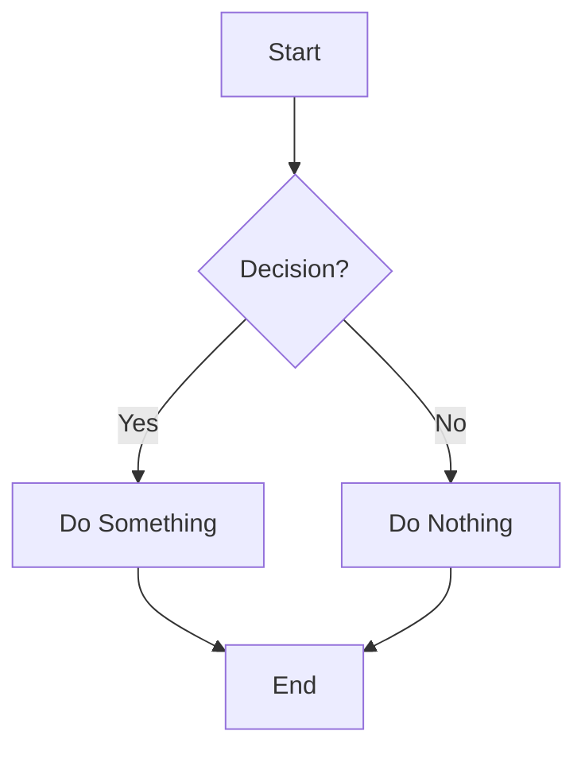

# Sample Audit Report

This is a sample content file to demonstrate how the content system works. You can add any markdown files to the `content/` directory and they will be automatically displayed.

## Features

- **Markdown Support**: Full markdown rendering with syntax highlighting
- **Front Matter**: Support for metadata like title, date, authors, and tags
- **Table of Contents**: Automatic generation from headers
- **Mermaid Diagrams**: Support for diagrams and charts
- **Responsive Design**: Works on all devices

## Usage

1. Add markdown files to the `content/` directory
2. Include front matter with metadata
3. Files will automatically appear in the content listing
4. Access individual files at `/content/[filename]`

## Example Code

```javascript
// This is a code block
function hello() {
  console.log("Hello, world!");
}
```

## Example Diagram



That's it! You can now add any type of content - audit reports, technical documentation, research papers, or anything else you want to share.
